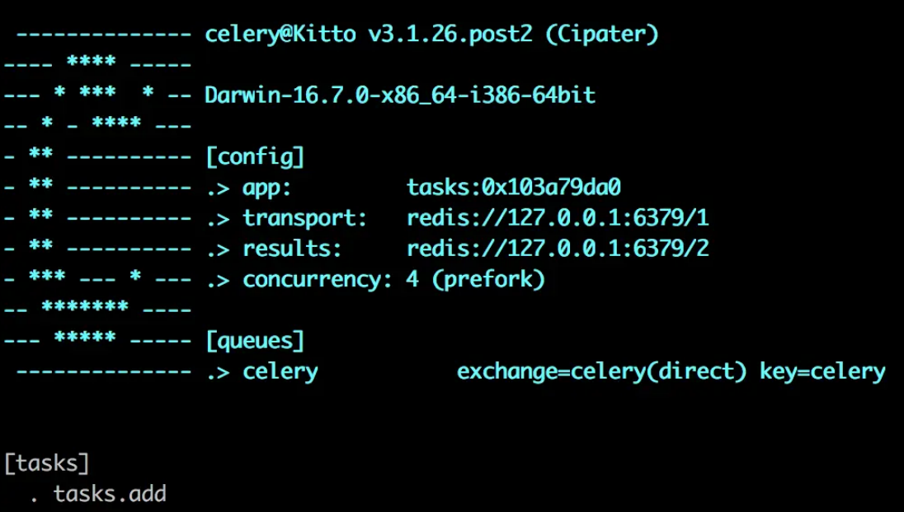
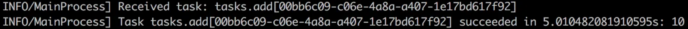
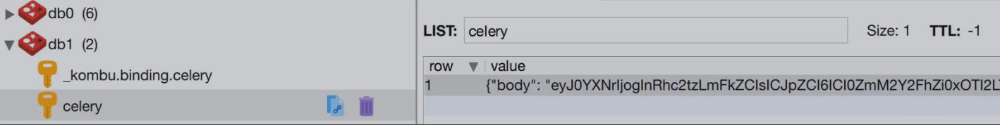
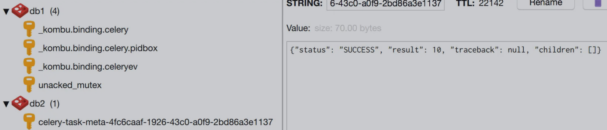
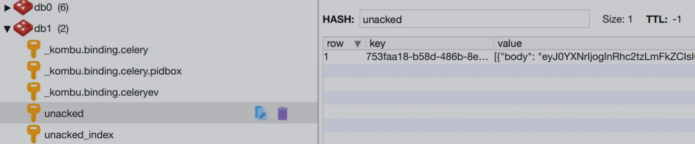
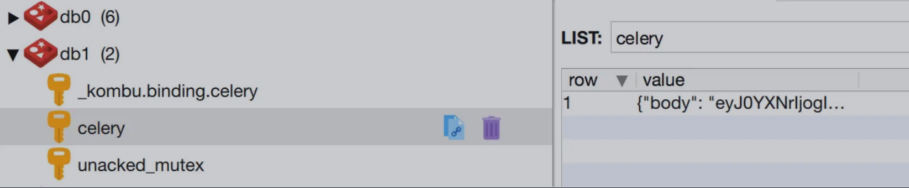

# Celery 入门和工作原理
## Celery 简介
Celery 是⼀个由 Python 编写的简单、灵活、可靠的分布式任务队列，⽀持实时的任务处理，也⽀持任务的定时调度。

Celery 依赖于 Python 的 Kombu 消息库，Kombu 为 AMQP(Advanced Message Queuing Protocol，即⾼级消息队列协议) 协议提供了通⽤的⾼层接⼝。

## Celery 架构
Celery 的架构组成如下图所⽰：


可以看出，Celery 中主要包含以下这⼏个模块：
- Task：包括异步任务和定时任务，异步任务由应⽤程序触发并发往任务队列，定时任务由 Celery Beat 调度器定时周期性地发往任务队列
- Broker：消息中间件，即⽤于接收并存储任务信息的消息队列，Celery 本⾝不提供消息服务，官⽅推荐使⽤ RabbitMQ 和 Redis
- Worker：任务执⾏单元，实时监控 Broker，⼀旦发现有任务就获取并执⾏
- Backend：任务结果存储，Worker 执⾏完任务后会⾃动写⼊，可以使⽤ RabbitMQ、Redis、Django ORM 等

## 快速⼊⻔
通过⼀个简单的例⼦来演示 Celery 的使⽤，这⾥ Broker 和 Backend 均采⽤ Redis。

1. pip 安装 Celery。
2. 创建 Celery 实例。Celery 实例可以指定 broker、backend 等信息，也可以指定读取的配置⽂件；通过 task 装饰器将普通的函数修饰为 task 对象。

```py
# tasks.py

import time
from celery import Celery

app = Celery('tasks', broker='redis://127.0.0.1:6379/1', backend='redis://127.0.0.1:6379/2')

@app.task
def add(x, y):
    time.sleep(5)
    return x + y
```

3. 启动 worker。在当前⽬录下通过 celery worker 命令来启动 worker，参数 -A 指定 Celery 实例的位置，worker 会⾃动在指定的⽂件中找到 Celery 实例。
在⽣产环境中，可以通过 supervisor 来管理 worker 进程。启动成功后，控制台会输出显示如下配置信息：

```bash
% celery worker -A tasks --loglevel=info
```



4. 发送任务。使⽤ delay 或 apply_async ⽅法来发送任务，具体 API 可以参考[官⽹](https://docs.celeryq.dev/en/latest/userguide/calling.html)。
返回的是⼀个 AsyncResult 对象，可以获取任务执行信息。
在 worker 控制台可以看到，worker 接收到了 broker 中的任务并成功执⾏。

```bash
>>> from tasks import add
>>> add.delay(2, 8)
<AsyncResult: 00bb6c09-c06e-4a8a-a407-1e17bd617f92>
>>> ar.ready()
True
>>> ar.get()
10
```



## Worker 和 Broker 交互过程分析
通过上⾯⼊⻔的例⼦来分析 Worker 和 Broker 的交互过程，步骤如下：

1. 先不启动 worker，发起⼀个任务，可以看到 broker 中⽣成了⼀个 celery 的 key，类型为 list，是⽤于保存任务信息的队列。



2. 再启动 worker，此时 broker 中的 celery key 消失，表明任务已成功被 worker 接收并执⾏；backend 中每个任务执⾏结果都⽤⼀条记录表⽰，类型为 string。



3. 将之前代码中的 add.delay(2, 8) 改成 add.apply_async((2, 8), countdown=60)，发起⼀个延时 60 秒后执⾏的任务。
此时 broker 中⽣成了 unacked 和 unacked_index 两个 key。
unacked ⽤于保存被 worker 接收了但还未开始执⾏的任务，类型为 hash；unacked_index ⽤于保存这些任务的 id，即 unacked 中哈希的 key 的集合，类型为 zset。
60 秒后，unacked 和 unacked_index 两个 key 消失，表明任务已被 worker 成功执⾏。



4. 模拟异常情况。在 worker 接收任务但还没到 60 秒时，中断 worker 运⾏，此时 broker 中⼜⽣成 celery 的 key。
再次启动 worker，broker 中 celery key 消失，任务被重新接收并执⾏。



由以上的现象可以推测 celery 和 redis 的交互原理：
1. 当发起⼀个任务时，会往 redis 的 celery key 中插⼊⼀条记录，这条记录会⼀直保存直到被 worker 接收；
2. worker 接收后，任务记录会从 celery key 中移除并添加到 unacked 和 unacked_index 中；
3. worker 在开始执⾏任务前会通知 redis，redis 将 unacked 和 unacked_index 中相关的任务记录移除；(如果是设置了 CELERY_ACKS_LATE = True 则会在任务执⾏完成后通知)
4. 在 redis 收到通知前，若 worker 中断了，则 unacked 和 unacked_index 中的记录会返回到 celery key 中保存，以防⽌任务丢失。

## Worker 启动过程简介
Celery Worker 启动过程中会有两个 blueprint：worker 和 consumer，这两个 blueprint 都包含有⼀些 bootstep 启动项，bootstep 之间有依赖关系，即它们的启动是有先后顺序的。

依赖关系如下图所⽰：


从 Celery Worker 的源码中也可以看出来：

```py
class WorkController:
    """Unmanaged worker instance."""

    ......

    class Blueprint(bootsteps.Blueprint):
        """Worker bootstep blueprint."""

        name = 'Worker'
        default_steps = {
            'celery.worker.components:Hub',
            'celery.worker.components:Pool',
            'celery.worker.components:Beat',
            'celery.worker.components:Timer',
            'celery.worker.components:StateDB',
            'celery.worker.components:Consumer',
            'celery.worker.autoscale:WorkerComponent',
        }

class Consumer:
    """Consumer blueprint."""

    ......

    class Blueprint(bootsteps.Blueprint):
        """Consumer blueprint."""

        name = 'Consumer'
        default_steps = [
            'celery.worker.consumer.connection:Connection',
            'celery.worker.consumer.mingle:Mingle',
            'celery.worker.consumer.events:Events',
            'celery.worker.consumer.gossip:Gossip',
            'celery.worker.consumer.heart:Heart',
            'celery.worker.consumer.control:Control',
            'celery.worker.consumer.tasks:Tasks',
            'celery.worker.consumer.consumer:Evloop',
            'celery.worker.consumer.agent:Agent',
        ]
```

```py
class Hub(bootsteps.StartStopStep):
    """Worker starts the event loop."""

    requires = (Timer,)
```

启动顺序是从下往上的，即 Timer 是最先启动的，然后依据箭头⼀层⼀层往上来启动。

同时 Celery 中也⽀持⾃定义 bootstep，具体可参考官网 [Extensions and Bootsteps](https://docs.celeryq.dev/en/latest/userguide/extending.html#blueprints)。
