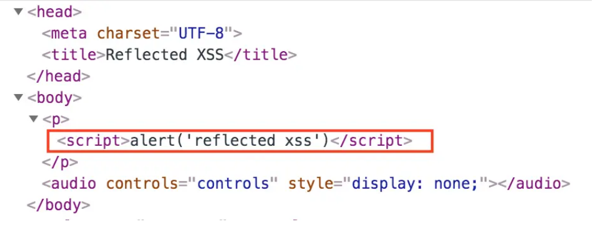
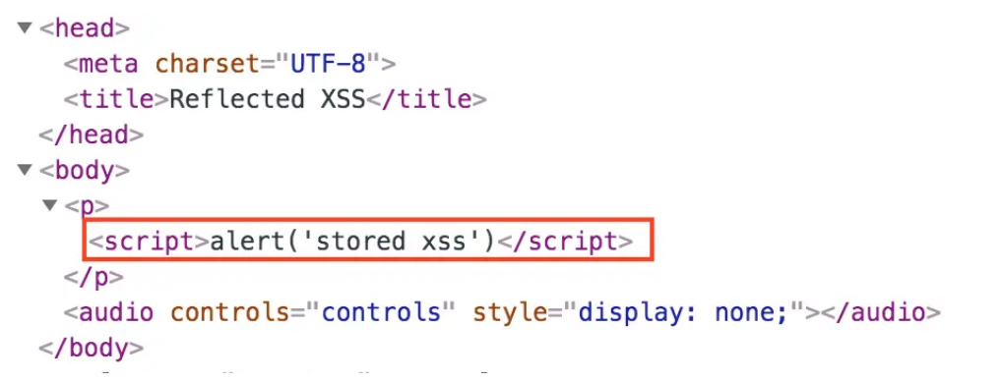

# XSS 攻击和防御
## XSS 是什么
摘⾃维基百科的解释：

> 跨站脚本（英语：Cross-site scripting，通常简称为：XSS）是⼀种⽹站应⽤程序的安全漏洞攻击，是代码注⼊的⼀种。
> 它允许恶意用户将代码注⼊到⽹⻚上，其他用户在观看⽹⻚时就会受到影响。这类攻击通常包含了HTML以及用户端脚本语⾔。
> XSS攻击通常指的是通过利⽤⽹⻚开发时留下的漏洞，通过巧妙的⽅法注⼊恶意指令代码到⽹⻚，使用户加载并执⾏攻击者恶意制造的⽹⻚程序。
> 这些恶意⽹⻚程序通常是JavaScript，但实际上也可以包括Java，VBScript，ActiveX，Flash或者甚⾄是普通的HTML。
> 攻击成功后，攻击者可能得到更⾼的权限（如执⾏⼀些操作）、私密⽹⻚内容、会话和cookie等各种内容。

为了和层叠样式表 CSS 的缩写进⾏区分，跨站脚本攻击把第⼀个字⺟改成了X，缩写为XSS。

XSS 本质就是：攻击者将未经过滤的恶意代码插⼊到 Web ⻚⾯中，浏览器⽆法识别这些恶意代码是不可信的， 所以用户在浏览该⻚⾯时，恶意代码将会被执⾏，从⽽直接获取用户信息，或利⽤这些信息冒充用户发起请求。

## XSS 的分类
XSS ⼤致可以分为三类：
- 反射型 XSS
- 存储型 XSS
- DOM 型 XSS

### 反射型 XSS
反射型 XSS 也叫做⾮持久型 XSS，这种⽅式对于访问者来说是⼀次性的。

具体表现为恶意代码通过 url 参数传递给服务器，服务器解析参数后不加任何过滤处理，直接把恶意代码“反射”给浏览器解析执⾏。

攻击者⼀般会结合多种⼿段诱导用户点击恶意链接。

反射性 XSS 的恶意代码流向⼤致为：url -> 服务器 -> 浏览器。

### 存储型 XSS
存储型 XSS 和反射型 XSS 的最⼤区别在于：存储型 XSS 会将恶意代码存储到数据库中，服务器从数据库中读取恶意代码返回给浏览器解析执⾏。

任何访问⻚⾯的用户都有可能会执⾏到恶意代码，因此这种⽅式稳定性更⾼，危害更⼤。

存储型 XSS 的恶意代码流向⼤致为：form 表单 -> 服务器 -> 数据库 -> 服务器 -> 浏览器。

### DOM 型 XSS
DOM 型 XSS 通过修改原始的客户端代码从⽽改变浏览器的 DOM 环境。

DOM 型 XSS 读取和执⾏恶意代码均在浏览器端完成，不经过服务器，属于前端 JS 的安全漏洞。

DOM 型 XSS 的恶意代码流向⼤致为：url -> 浏览器。

## XSS 攻击原理
下⾯分别举例⼦简单演⽰⼀下这三种不同 XSS 的攻击过程。

### 反射型 XSS
如下例⼦，视图函数获取到接⼝的查询参数后直接渲染到模板中显⽰，不经过任何过滤和转义操作。（Django 模板默认会对渲染变量进⾏转义，safe 表⽰进行不转义）

```py
def reflected_xss(request):
    query = request.GET.get("query")
    return render(request, "reflected_xss.html", {"query": query})
```

```html
<body>
    <p>{{ query | safe }}</p>
</body>
```

如果用户点击了如下 url，则 script 脚本会注⼊到模板中被浏览器解析执⾏。

```
http://127.0.0.1/api/xss/reflected/?query=<script>alert('reflected xss')</script>
```



### 存储型 XSS
如下例⼦，视图函数查询数据库中用户的 profile 信息，渲染到模板中显⽰。

```py
def stored_xss(request, user_id):
    profile = User.objects.get(id=user_id).profile
    # profile = "<script>alert('stored xss')</script>"
    return render(request, "stored_xss.html", {"profile": profile})
```

```html
<body>
    <p>{{ profile | safe }}</p>
</body>
```

如果用户的 profile 被提交了 script 脚本代码的话，则会注⼊到模板中被浏览器解析执⾏。



### DOM 型 XSS
如下例⼦，链接到⻚⾯浏览器执⾏ script 脚本，会⽤当前链接的 url 参数在当前⻚⾯插⼊⼀个超链接。

```html
<body>
    <div id="url"></div>
</body>
<script>
    let url = new URL(window.location.href).searchParams.get("url")
    document.getElementById("url").innerHTML = "<a href='" + url + "'>DOM XSS</a>"
</script>
```

如果攻击者伪造如下链接（url 参数最前⾯的引号⽤于闭合掉 href 的第⼀个引号，最后⾯的注释符"//"⽤于注释掉 href 的第⼆个引号）

```
"http://127.0.0.1/xss/dom/?url=' onclick="alert('dom xss')" //"
```

则 "url" div 块中将被插⼊如下代码，用户点击链接会执⾏ alert 脚本。

```html
<a href='' onclick="alert('dom xss')" //'>>DOM XSS</a>
```

## XSS 实际利⽤
上⾯的 JS 弹窗只是为了演⽰ XSS 的攻击原理，在实际应⽤中肯定不会这么简单，XSS 攻击可以做的事情很多。

### 劫持访问
劫持请求实现恶意跳转，⽐如在某个⽹站中插⼊如下恶意脚本，那么在访问该⽹站时就会⾃动跳转到百度⾸⻚。

```js
<script>window.location.href="https://www.baidu.com";</script>
```

可以⽤来实现社交平台刷关注量和发送钓⻥链接等。

### 盗取 cookie
JS 中可以通过 document.cookie 获取到当前⻚⾯的 cookie，攻击者注⼊恶意 Script 脚本可以盗取用户的 cookie。

在⽹站登录成功后服务端会返回给用户⼀个 cookie 值，这个 cookie 值是用户访问该⽹站其他⻚⾯的令牌， 如果这些重要的 cookie 被盗取，攻击者可以冒充用户，无需验证即可登录该⽹站。

### 恶意请求
CSRF 攻击就是在未经用户许可下冒充用户名义发送诸如更改密码、转账等恶意请求，通过 XSS 攻击在用户浏览器注⼊恶意脚本，可以实现在用户不知情下⾃动发送恶意请求。

## XSS 绕过过滤
下⾯总结⼀些 XSS 攻击绕过程序的过滤规则的⽅法。

### ⼤⼩写绕过
标签的⼤⼩写并不会影响其在浏览器中的解析执⾏，所以如果程序只是过滤了 `<script>` 标签的话，可以通过以下⽅式进⾏绕过：

```
http://127.0.0.1/api/xss/reflected/?query=<sCript>alert('reflected xss')</sCript>
```

### 过滤后返回的参数仍然构成脚本代码
如果程序只是过滤了⼀次 `<script>` 标签的话，可以制造巧合，让过滤了 `<script>` 标签后的返回参数仍然包含 `<script>` 标签，如下所⽰：

```
http://127.0.0.1/api/xss/reflected/?query=<sCri<script>pt>alert('reflected xss')</sCri</script>pt>
```

### 利⽤特殊的 HTML 标签和属性
能注⼊攻击脚本的并不只有 `<script>` 标签，⼀些特殊的 HTML 标签和属性也可以做到。

⽐如 `` 标签，因为 src 指定的图⽚地址是乱写的，根本不存在，所以 onerror 的脚本代码肯定会被执⾏。

```
http://127.0.0.1/api/xss/reflected/?query=
```

再如 `<a>` 标签的 href 属性，用户点击 `<a>` 标签将会执⾏脚本代码。

```html
<a href="{{ redirect }}">链接</a>
```

```
http://127.0.0.1/api/xss/reflected/?redirect=javascript:alert('reflected xss')
```

### 对脚本代码关键字进⾏编码
程序可能会对脚本代码中的关键字（⽐如 alert）进⾏过滤，这时我们可以对关键字进⾏编码，再通过 eval 函数解码得以让浏览器成功解析：

```
http://127.0.0.1/api/xss/reflected/?query=<script>eval(\u0061\u006c\u0065\u0072\u0074('reflected xss'))</script>
```

### 闭合引号实现注⼊
如果⽹⻚中存在有如下代码，url 参数直接被变量引⽤：

```js
<script>
    let a = '{{ query }}';
</script>
```

那么可以通过以下链接实现脚本代码注⼊：

```
http://127.0.0.1/api/xss/reflected/?query=';alert('reflected xss');'
```

注⼊后的代码将变成这样：

```js
let a = '';alert('dom xss');''
```

## XSS 的防御
针对 XSS 攻击，可以从⼏个方面进⾏防御。

### 服务端代码
- 过滤掉 `<script>`、``、`<a>` 等可能引起脚本注入的 HTML 标签
- 对于预期的输⼊，进⾏数据格式校验或限制⻓度来进⾏脚本截断
- 对敏感重要的 cookie 设置为 HttpOnly，禁⽌ JavaScript 读取

### 前端代码
- 对诸如 `<` `>` `"` 等符号进⾏转义编码，这样不会被浏览器所解析执⾏但也不影响其显⽰效果
- 尽量避免使⽤ innerHTML 和 onerror/onclick 等包含 XSS 隐患的内联事件

### 开发框架
使⽤较为安全的开发框架，⽐如 Django 默认会对模板渲染变量进⾏⾃动转义，以防⽌ HTML 注⼊

### 浏览器
内容安全策略（Content Security Policy，简称 CSP）是 W3C 组织推出的⽤于防御 XSS 攻击的技术，现已被⼤多数主流浏览器所⽀持。

CSP 本质就是⼀种⽩名单机制，⽹站通过 Content Security Policy 这个信息告诉浏览器哪些外部资源是可以被加载执⾏的，这个信息可以通过 HTTP 响应头或 `<meta>` 标签的形式出现。

⽐如⽹站返回如下形式的响应头，则⽹⻚中 `` 标签的 src 属性只有是当前⽹站的才会被浏览器所加载执⾏，当然除了 self，还可以指定具体的外部⽹站。

```
content-security-policy: img-src 'self';
```

CSP 还提供了 report-uri 字段⽤于指定⼀个服务器地址，当浏览器发现不合规定的资源时，除了拒绝加载还会把情况报告给这个地址，实现了报警功能。

CSP 的更多功能可以查看 [MDN](https://developer.mozilla.org/zh-CN/docs/Web/HTTP/CSP) 的⽂档。

## 总结
⽹络和代码安全是道⾼⼀尺魔⾼⼀丈的双⽅博弈的过程，没有绝对的安全和防御。

我们所能做的，是结合具体场景来组合使⽤多种合适的防御⼿段，不断减少安全漏洞，最⼤程度地降低被攻击的⻛险。

## 参考资料
- [XSS 维基百科](https://en.wikipedia.org/wiki/Cross-site_scripting)
- [内容安全策略（CSP）](https://developer.mozilla.org/zh-CN/docs/Web/HTTP/CSP)
- [美团前端安全系列（⼀）：如何防⽌XSS攻击？](https://tech.meituan.com/2018/09/27/fe-security.html)
