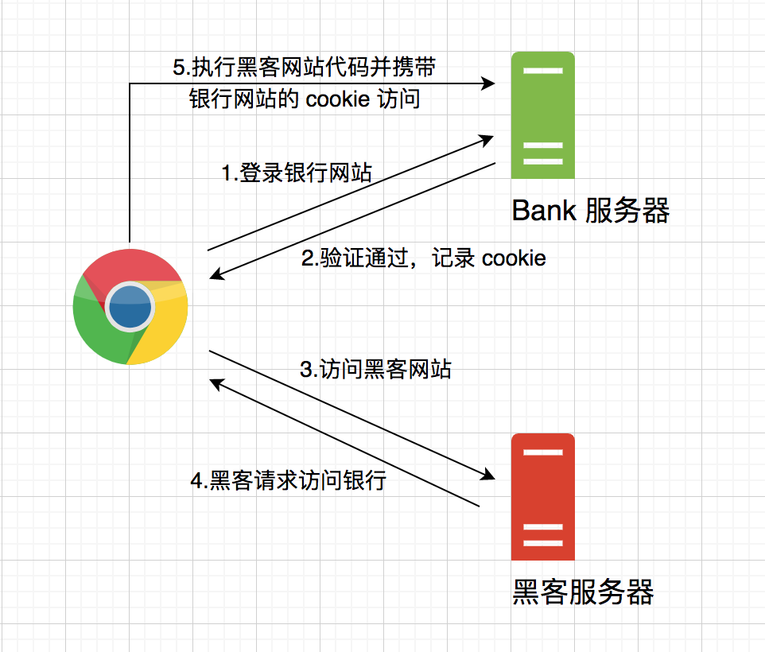

# CSRF 攻击及 Django CSRF 源码简析
## CSRF 是什么
摘⾃维基百科的解释：

> 跨站请求伪造（英语：Cross-site request forgery），也被称为 one-click attack 或者 session riding，通常缩写为 CSRF 或者 XSRF， 是⼀种挟制用户在当前已登录的 Web 应⽤程序上执⾏⾮本意的操作的攻击⽅法。
> 与跨站脚本攻击（XSS）相⽐，XSS 利⽤的是用户对指定⽹站的信任，CSRF 利⽤的是⽹站对用户⽹⻚浏览器的信任。
> 简单地说，是攻击者通过⼀些技术⼿段欺骗用户的浏览器去访问⼀个⾃⼰曾经认证过的⽹站并运⾏⼀些操作（如发邮件，发消息，甚⾄财产操作如转账和购买商品）。
> 由于浏览器曾经认证过，所以被访问的⽹站会认为是真正的用户操作⽽去运⾏。
> 这利⽤了Web 中用户⾝份验证的⼀个漏洞：简单的⾝份验证只能保证请求发⾃某个用户的浏览器，却不能保证请求本⾝是用户⾃愿发出的。

CSRF ⽐ XSS 更具危险性，攻击者利⽤受害者的登录状态或授权状态，以受害者的名义发送恶意请求，对服务器来说这个请求是完全合法的，但是却完成了攻击者所期望的⼀个操作。

CSRF 造成的问题包括：个⼈隐私泄露以及财产安全等。

## CSRF 攻击原理


⼀个典型的 CSRF 攻击流程如下：
1. 用户登录可信任的银⾏⽹站：`www.bank.com`
2. 通过银⾏⽹站的认证，在用户浏览器本地保存 SESSIONID 等 Cookie 信息
3. 用户在没有退登银⾏⽹站的情况下访问不受信任的⿊客⽹站：`www.hacker.com`
4. ⿊客⽹站下，通过诱导点击等⼿段要求用户浏览器请求银⾏⽹站，此时浏览器会携带银⾏⽹站下的 SESSIONID 等 Cookie 信息过去
5. 银⾏⽹站接收请求后，对 Cookie 进⾏验证通过，误认为是用户⾃⼰发起的请求
6. CSRF 攻击完成，攻击者在用户不知情的情况下，冒充用户执⾏了转账操作

## CSRF 攻击类型
常⻅的 CSRF 攻击类型包括以下三种：
- GET 类型，例如加载 `` 标签⾃动发起 GET 请求
```html

```

- POST类型，例如⾃动提交表单发起 POST 请求
```
<html>
    <form action="https://www.bank.com/withdraw" method=POST id="csrf-form">
        <input type="hidden" name="from" value="kittolin" />
        <input type="hidden" name="to" value="hacker" />
        <input type="hidden" name="amount" value="100" />
    </form>
</html>
<script>
    document.getElementById("csrf-form").submit();
</script>
```

- 链接类型，诱导用户点击发起 GET 请求
```html
<a href="https://www.bank.com/withdraw?from=kittolin&to=hacker&amount=100" taget="_blank">想一夜暴富吗？<a/>
```

## CSRF 的特点
通过上⾯ CSRF 的攻击图⽰，可以发现，CSRF 攻击要想成功进⾏，必须同时满⾜两个条件：
1. 用户登录可信任⽹站，在浏览器本地保存登录凭证 Cookie
2. 用户在不退登可信任⽹站的情况下，访问危险⽹站

CSRF 攻击具有以下特点：
- 攻击⼀般注⼊在第三⽅⽹站，⽽不是被攻击的⽹站（XSS 注⼊⼀般在被攻击⽹站）
- 攻击者仅仅是冒充受害者提交操作，⽽⽆法获取到受害者的登录凭证，不能直接窃取数据
- 跨站请求的发起可以采⽤多种⽅式，包括: 图⽚ url、超链接、form 表单等
- 部分跨站请求可以直接嵌⼊到第三⽅可信任论坛、评论区和⽂章中，甚⾄在本域下发起攻击，难以追踪防御（和 XSS 攻击配合使⽤）

可以发现，在整个攻击过程中，攻击者⽆法获取到用户的 Cookie，也⽆法获取到服务器返回的响应数据，攻击者仅仅能做的只是发起请求。

所以，针对 CSRF 攻击我们要保护和防御的对象是会产⽣数据变化的服务，对于读取数据的服务⽆需做防御。

这⾥可能有个疑问就是：CSRF 攻击⼀般注⼊在第三⽅⽹站，发起的是跨域请求，浏览器的同源策略和 CORS 策略不正是防范跨域请求的吗？

答案是：针对 CORS 的”简单请求”，浏览器并不能限制发起请求，⽽只是拦截了服务器的响应数据，请求还是成功发起了，这样攻击者的⽬的已经达成了，并不关⼼返回的数据内容。

具体 CORS 的详细内容，可以查看 [MDN CORS](https://developer.mozilla.org/zh-CN/docs/Web/HTTP/CORS)。

## CSRF 的防御
⽬前防御 CSRF 攻击主要有以下⼏种策略：
- 验证 HTTP Referer 请求头字段
- 在请求参数中添加 token
- 在 HTTP 请求头中⾃定义属性添加 token
- SameSite Cookie

### 验证 HTTP Referer 请求头字段
HTTP 请求头中有⼀个 Referer 字段，⽤来表明请求来源于哪个地址。

因为 CSRF 攻击⼤多发起在第三⽅⽹站，所以可以通过这个字段来判断请求是否为合法请求。

⽐如，用户正常在银⾏⽹站下发起转账请求，此时 Referer 字段指向银⾏⽹站的域名，则判定为合法请求；⽽如果用户被 CSRF 攻击在⿊客⽹站下发起对银⾏的转账请求，此时 Referer 字段指向⿊客⽹站的域名，则判定为⾮法请求。

这种⽅法的好处是简单易⾏，⼯作量少，只需要在所有敏感数据操作的请求前统⼀增加个拦截器检查 Referer 字段即可；

但这种⽅法也有局限性，就是完全把安全性依赖于浏览器来保障，如果 Referer 字段被篡改或者用户浏览器设置不发送 Referer 字段时这种防御⽅式就失去意义了。

### 在请求参数中添加 token
CSRF 攻击之所以能够成功进⾏，在于攻击者可以完全伪造请求中的所有参数，所以如果我们要求在请求中加⼊攻击者⽆法伪造的参数，⽐如⼀个随机⽣成的 token，那么就可以在服务器端判断 token 是否传递以及 token 是否正确，来将正常请求和攻击请求区分开。

token 可以在用户成功登陆后⽣成并存放于服务器端 Session 中或用户浏览器 Cookie 中。

#### token 存放于 Session 中
用户访问⽹站时，需要先请求服务器端⽣成 token 并存放于当前用户的 Session 中，同时返回给浏览器端，浏览器取得 token 后嵌⼊ form 表单中；

在提交 form 表单请求时，会将请求参数中的 token 和当前用户 Session 中的 token 进⾏⽐对，来判定是否为⼀次合法的请求。

⽐如如下所示的 Django 模板，会请求服务器端⽣成 token 并嵌⼊当前 form 表单中。
```html

<form method="post">
    
</form>

```

#### token 存放于 Cookie 中
1. 用户访问⽹站时，服务器端向当前域名下注⼊⼀个 token 的 Cookie
2. 浏览器端提交 form 表单请求时，通过 JS 取得当前域名下的 token Cookie 值，并放⼊请求参数中
3. 服务器端⽐对请求参数中的 token 和 Cookie 中的 token 是否⼀致，只有⼀致才判定为合法请求

这种⽅法⽐检查 Referer 头字段安全⼀些，但难点在于需要⼿动编程在所有 form 表单和超链接中加⼊ token 参数，除此之外安全问题也值得关注。

⽐如，⼿动编程在链接中加⼊ token 参数时，需要判断链接是否是本域的，如果是外域则不能加 token 防⽌ token 泄露。

链接中加⼊ token 参数也有可能会通过 Referer 字段暴露，所以针对敏感数据操作请求，⼀定要⽤ POST 请求，⽽不能⽤ GET 请求。

### 在 HTTP 请求头中⾃定义属性添加 token
这种⽅法和上⼀种⽅法⼀样，也是传递 token 进⾏校验，区别在于 token 并不是放⼊请求参数中，⽽是 HTTP 头中的⾃定义属性。

通常⽤于 Ajax 异步请求中，通过 XMLHttpRequest 这个类，⼀次性给所有该类请求添加 csrftoken HTTP 头属性。

### SameSite Cookie
SameSite Cookie 是 Google 提出的⽤于防范 CSRF 攻击的策略，就是为 Set-Cookie 响应头新加 SameSite 属性，SameSite 常⽤的有两个属性值: Strict 和 Lax。

- SameSite=Strict (严格模式，只有本域请求才可以携带这个 Cookie，所有的跨域请求都不能携带)
```
Set-Cookie: session_id=xxxxxxxx; SameSite=Strict
```

- SameSite=Lax (宽松模式，⽐ Strict 模式放宽了些限制，只有本域请求或 `<a>` 标签、`<link>` 标签及 GET 类型的 form 表单这三种情况下的跨域请求才可以携带这个 Cookie)
```
Set-Cookie: session_id=xxxxxxxx; SameSite=Lax
```

SameSite Cookie 直接从源头上解决了 CSRF 攻击问题，但⽬前这种⽅法还不成熟，除 Chrome 和 Firefox 外，其他浏览器并未安全⽀持和普及。

除了上⾯提到的四种策略之外，还有包括验证码和⼆次密码验证等其他防范 CSRF 的措施，⽽且安全性上更⾼，但代价是很影响用户体验。

## Django CSRF 源码浅析
有了上⾯ CSRF 攻击和防御的基础知识，再来看 Django 中对 CSRF 的代码实现就⽐较简单了。

Django 是采⽤中间件机制来实现 CSRF 的防御的，简单地说就是在 view 函数处理业务请求前执⾏中间件的 process_request 和 process_view ⽅法，在 view 函数返回响应后执⾏ process_response ⽅法。

更多 Django 中间件的原理可以看这篇[技术博客](https://www.liujiangblog.com/blog/45/)和 [Django 官⽅⽂档](https://docs.djangoproject.com/en/3.1/topics/http/middleware/)。

下⾯基于 Django 2.0.2 简单分析 CSRF 中间件的实现原理，更多代码细节可以看 github 上 [Django CSRF 源码](https://github.com/django/django/blob/2.0.2/django/middleware/csrf.py)。

### 模块内置的函数
#### _get_failure_view()
获取 CSRF 校验失败后返回给前端浏览器的错误⻚⾯视图，可以通过配置⽂件的 CSRF_FAILURE_VIEW ⾃定义视图。

默认视图是 "django.views.csrf.csrf_failure"，返回 403 Forbidden ⻚⾯。

#### _get_new_csrf_string()
获取 32 位的只包含⼤⼩写字⺟和数字的随机字符串，⽤于后续⽣成 32 位的 CSRF secret 和 32 位的 salt。

#### _salt_cipher_secret(secret)
对 32 位的 CSRF secret 加盐，⽣成 64 位的 CSRF token。

假设传⼊的 32 位的 secret 为 "2vhAyHRN0torNQN8HTkEfcMUh8eb9QrU"，加盐算法过程如下：

1. 随机⽣成 32 位的 salt: "ZXHjpLEP83DDXNgroYzRgo3Spsyiq158"；
2. 取 secret 的第⼀个字符 '2' 在 CSRF_ALLOWED_CHARS 字符串中的索引 54，加上 salt 的第⼀个字符 'Z' 在 CSRF_ALLOWED_CHARS 字符串中的索引 51，得到 105；
3. 105 对 CSRF_ALLOWED_CHARS 的⻓度 62 取余得到 43，CSRF_ALLOWED_CHARS 的索引为 43 的字符 'R' 即为 cipher 的第⼀个字符；
4. 以此类推，32 位的 secret 和 32 位的 salt 按上⾯的算法⽣成 32 位的 cipher: "RiOJNilsYmRUAtTpVHJllqFCwqCjpHmS"；
5. 最后 32 位的 salt 连接上 32 位的 cipher 即⽣成 64 位的 token。

#### _unsalt_cipher_token(token)
对 64 位的 CSRF token 去盐，解密得到 32 位的 CSRF secret。

去盐算法过程为: 传⼊ 64 位的 token，拆分成两部分，32 位的 salt 和 32 位的 cipher，cipher 和 salt ⽤上⾯加盐算法的逆过程解密，得到 32 位的 secret。

#### _get_new_csrf_token()
⽤上⾯的 _salt_cipher_secret 加盐算法，⽣成一个新的 64 位的随机 token。

#### get_token(request)
上⾯提到的 Django 模板：
```html

<form method="post">
    
</form>

```

最终渲染后的执⾏代码如下，会调⽤ get_token 请求⽣成新的 token 嵌⼊ form 表单中。

```py
def csrf_input(request):
    return format_html('<input type="hidden" name="csrfmiddlewaretoken" value="{}" />', get_token(request))
```

get_token 函数会对当前 request 对象中设置⼀个标志：CSRF_COOKIE_USED = True。

这个标志会在后续的 process_response ⽅法中将 token 注⼊用户浏览器 Cookie 或存放到用户 Session 中。

#### rotate_token(request)
Django 框架⾃带有注册登录模块，为了安全性考虑，在用户登录成功后会调⽤这个 rotate_token 函数，来刷新用户浏览器 CSRF Cookie 或用户 Session 的 CSRF token。

rotate_token 函数只是在当前 request 对象中设置两个标志：CSRF_COOKIE_USED 和 csrf_cookie_needs_reset，在后续的 process_response ⽅法中会根据这些标志来刷新 token。

#### _sanitize_token(token)
新版本 Django 中对 CSRF token 的要求是 64 位的只包含⼤⼩写字⺟和数字的随机字符串，这个函数会对不满⾜条件的 token 进⾏重新⽣成。

旧版本 Django 中的 CSRF token 是 32 位的，新版本为了向下兼容，将这原先的 32 位的 token 当做 32 位的 secret 进⾏加盐，返回新的 64 位 token。

#### _compare_salted_tokens(request_csrf_token, csrf_token)
⽤于判断两个 64 位的 CSRF token 是否匹配。判断前会分别对两个 token 进⾏去盐，得到两个 32 位的 secret，再判断这两个 secret 是否相等。

#### _accept(self, request)
当 CSRF 校验通过后调⽤这个⽅法，放⾏执⾏ view 业务请求。

#### _reject(self, request, reason)
当 CSRF 校验失败后调⽤这个⽅法，直接返回给浏览器错误提⽰⻚⾯。

#### _get_token(self, request)
Django 可以通过配置⽂件的 CSRF_USE_SESSIONS 来配置 CSRF token 是存放于 Session 还是 Cookie 中，默认为 False，即存放于 Cookie 中。

这个函数会根据 CSRF_USE_SESSIONS 的取值，去 Session 或 Cookie 中获取 CSRF token 返回。

如果是存放于 Cookie 中的话，还会对旧版本的 32 位 token 进⾏清洗重新⽣成并设置 csrf_cookie_needs_reset 标志。

#### _set_token(self, request, response)
根据 CSRF_USE_SESSIONS 的取值，来往 Session 或 Cookie 中重新设置 CSRF token 值。

### CSRF 中间件的三个关键⽅法
#### process_request
调⽤ _get_token ⽅法从用户 Session 或 Cookie 中获取 CSRF token，并赋值给当前 request 对象 META 属性的 CSRF_COOKIE 变量。

这个 token 在后续的代码执⾏过程中会一直传递下去，使⽤这同⼀个 token 进⾏校验。

#### process_view
这个⽅法是真正进⾏ CSRF 校验的地⽅，根据校验结果来调⽤ _accept ⽅法放⾏请求或调⽤ _reject ⽅法拒绝请求跳转错误⻚⾯。

校验过程⼤致如下：

1. 判断 view 视图函数是否有设置 csrf_exempt 装饰器，如果有则跳过 CSRF 校验直接放⾏请求，否则继续下⾯的校验过程；
2. 判断 HTTP 请求⽅法是否为 GET/HEAD/OPTIONS/TRACE 中之⼀，如果是则跳过 CSRF 校验直接跳到第 7 步，调⽤ _accept ⽅法放⾏请求，否则继续下⾯的校验过程；
3. 判断当前请求链接是否为安全链接，即以 https 开头的，如果不是则跳过 Referer 头字段检查直接跳到第 6 步，否则继续下⾯的校验过程；
4. 判断 Referer 头字段是否存在，是否为合法的 url 地址，是否以 https 开头，只要有⼀个不是则调⽤ _reject ⽅法拒绝请求，否则继续下⾯的校验过程；
5. 获取配置⽂件中配置的 CSRF_TRUSTED_ORIGINS 信任域名列表和当前本域域名，判断 Referer 头字段指向的域名是否有和这些域名同源的，如果都不是则调⽤ _reject ⽅法拒绝请求，否则继续下⾯的校验过程；
6. 从请求参数或 HTTP ⾃定义头属性中获取请求 token，来和上⾯ process_request ⽅法获取到的 token 进⾏匹配是否⼀致，如果不⼀致则调⽤ _reject ⽅法拒绝请求，获取请求 token 后要进⾏清洗，保证调⽤ _compare_salted_tokens 进⾏匹配时传递的两个 token 都是 64 位的加盐的 token；
7. 上⾯⼀系列的校验都通过后，调⽤ _accept ⽅法放⾏执⾏ view 业务请求。

#### process_response
执⾏完 view 业务请求后才会调⽤这个⽅法。

该⽅法判断在当前的请求执⾏过程中是否有往 request 对象中设置 csrf_cookie_needs_reset=True 或 CSRF_COOKIE_USED=True 的标志。

如果有则调⽤ _set_token ⽅法往用户 Session 或 Cookie 中重新设置 token 值，具体是 Session 还是 Cookie 则是根据配置⽂件中 CSRF_USE_SESSIONS 的取值。

总的进行概括，process_request 从 Session 或 Cookie 中获取 token 一直往下传递，process_view 进⾏ CSRF 校验（包括 Referer 头字段和 token 的校验），process_response 根据请求过程中设置的标志来判断是否需要往 Session 或 Cookie 中重新设置 token。

## 参考资料
- [CSRF 维基百科](https://zh.wikipedia.org/wiki/%E8%B7%A8%E7%AB%99%E8%AF%B7%E6%B1%82%E4%BC%AA%E9%80%A0)
- [美团前端安全系列（二）：如何防止CSRF攻击？](https://tech.meituan.com/2018/10/11/fe-security-csrf.html)
- [Django 中间件机制介绍](https://www.liujiangblog.com/blog/45/)
- [Django 官⽅⽂档](https://docs.djangoproject.com/en/3.1/topics/http/middleware/)
- [Django 2.0.2 CSRF 源码](https://github.com/django/django/blob/2.0.2/django/middleware/csrf.py)
