红黑树是一种常见的自平衡二叉查找树，常用于实现关联数组、字典等，在各种编程语言的数据结构底层实现中被广泛使用。

比如 Java 的 TreeSet 和 TreeMap 数据结构就是基于红黑树实现的，Java 的 HashMap 默认用链表处理哈希冲突，在冲突超过 8 个时，会将链表转化成红黑树。

红黑树虽然结构复杂，但它有着极好的最坏情况运行时间，可以在 O(log n)完成查找、插入和删除。

想理解红黑树出现的意义，需要从一种最基本的二叉查找树讲起。

## 二叉查找树
二叉查找树是具备了以下特性的二叉树：
- 左子树所有节点的值都小于或等于根节点的值
- 右子树所有节点的值都大于或等于根节点的值
- 左右子树也分别是二叉查找树

二叉查找树利用二分查找的思想，在查找过程中会将待查找节点值和根节点值进行比较从而判断往左还是往右继续查找，查找的最大次数等于树的高度；插入过程也同理，所以二叉查找树的查找、插入和删除的平均时间复杂度均为 O(log n)。

但是如果连续插入一段有序的序列的话，查找树会向某一边倾斜，甚至退化成链表，最坏时间复杂度为 O(n)。这就是二叉查找树最大的问题：不平衡。

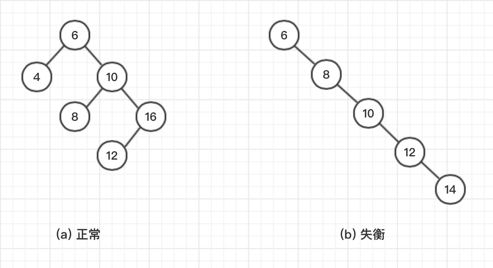

为了解决上述问题，出现了自平衡的二叉树。

## AVL 树
AVL 树是最早出现的⾃平衡⼆叉查找树，详⻅[维基百科](https://zh.wikipedia.org/wiki/AVL%E6%A0%91)。

在 AVL 树中，任意节点的左右⼦树的最⼤⾼度差为 1，所以查找、插⼊和删除的平均和最坏时间复杂度都是 O(log n)，但这是有代价的。

AVL 树中添加节点和删除节点可能需要从下往上进⾏⼀次或多次的节点旋转来实现树的重新平衡，当树的节点数量较多时，这涉及到了指针或引⽤的多次调整变更，是相当消耗性能的。

节点的旋转包括左旋和右旋：


## 2-3 树
红⿊树可以看成是 2-3 树的等价变换。理解了 2-3 树的特性及融合、拆分的过程，再去看红⿊树的 5 个特性和插⼊节点的 5 种情况就⽐较简单了。

### 2-3 树的基本概念
2-3 树本质上也是⼀种搜索树，满⾜搜索树的基本性质，和⼆叉搜索树的区别在于：2-3 树的节点可以是 2-节点（1 个元素，2 个⼦节点），也可以是 3-节点（2 个元素，3 个⼦节点）。

- 2-节点，p <= a <= q

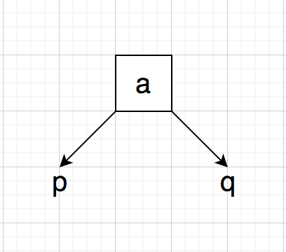

- 3 节点，p <= a <= q <= b <= r

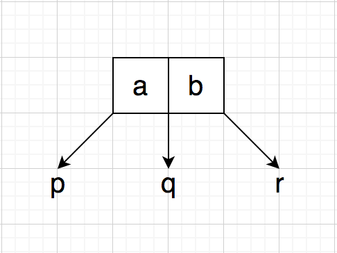

2-3 树任意节点的左右⼦树的⾼度差都为 0，所以是绝对平衡的多叉树，那么在添加新节点的过程中是如何维护这个性质的呢？

### 2-3 树添加节点过程
2-3 树和⼆分搜索树、AVL 树不同，添加新节点时，不会在空的位置上添加，⽽是先和最后的叶⼦节点融合，分两种情况考虑。

- 要融合的叶⼦节点是 2-节点，直接融合即可

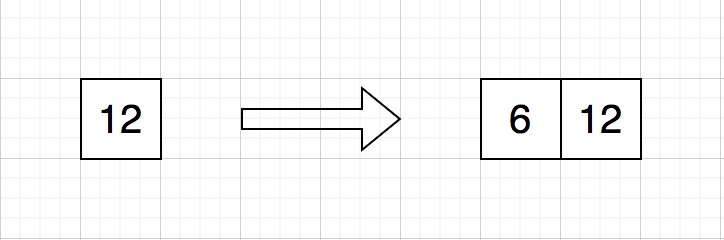

- 要融合的叶⼦节点是 3-节点，先融合成 4-节点，然后 4-节点拆分，中间元素向上融合，继续往上迭代这个过程，直至满⾜ 2-3 树的性质

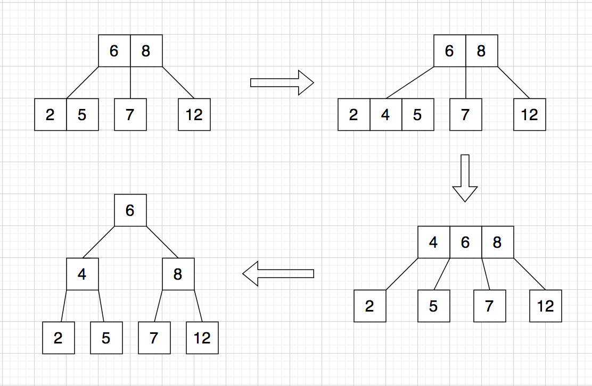

由于 2-3 树的这种结构以及融合、拆分的过程难于⽤代码操作，所以可以通过⼀些规则，将 2-3 树等价变换成红⿊树。

### 2-3 树和红⿊树等价变换过程
对于 2-3 树的 2-节点，直接转换成红⿊树的⿊节点即可；对于 3-节点，进⾏拆分，左元素作为右元素的⼦树，并将左元素标红，因此所有的红⾊节点只会出现在左⼦树上。

这种等价变换⽐较简单，也有红⾊节点出现在右⼦树的等价过程，这⾥不做介绍。

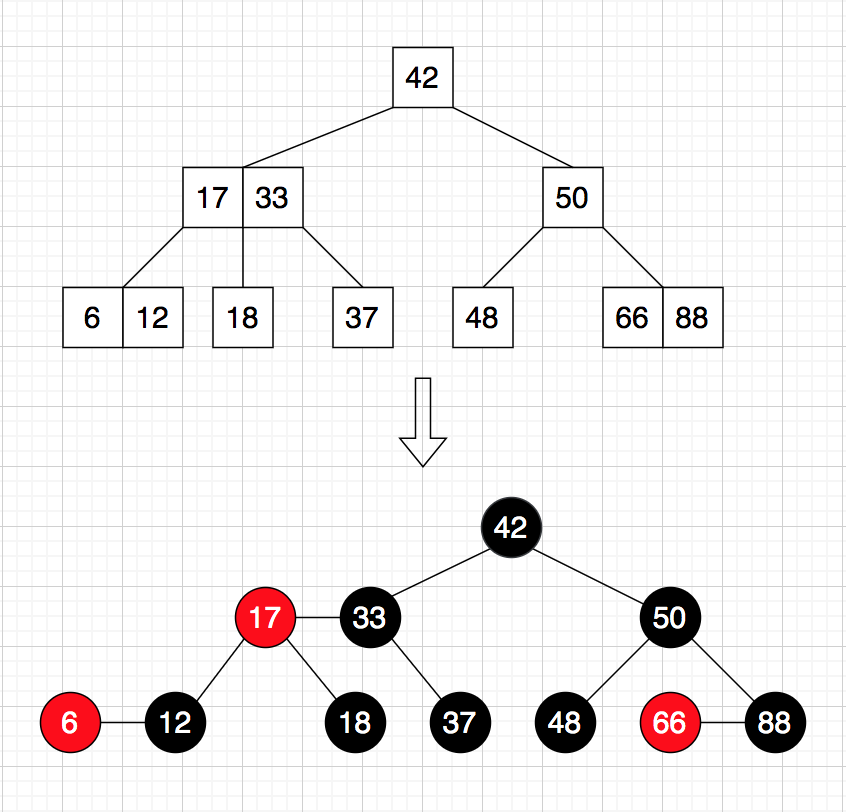

## 红黑树
写了这么多铺垫，终于到正题了。

红⿊树是⼀种满⾜以下 5 个性质的⼆分搜索树：
1. 每个节点要么是⿊⾊，要么是红⾊。⿊节点等价于 2-3 树的 2-节点或者 3-节点的右元素，红节点等价于 2-3 树 3-节点的左元素。
2. 根节点必须是⿊⾊的。不难想象，2-3 树的根节点不管是 2-节点还是 3-节点，等价变换到红⿊树的根节点⼀定是⿊⾊的。
3. 叶⼦节点是⿊⾊的 nil 节点。红⿊树的叶⼦节点不是指最后的左右⼦树都为空的节点，⽽是指 null 节点，标为⿊⾊。
4. 如果⼀个节点是红⾊的，那么它的⼦节点必须是⿊⾊的，即不会出现连续两个红⾊的节点。2-3 树中不存在 4-节点，所以红⿊树中不可能会有连续两个红⾊节点。
5. 从任意节点到叶⼦节点，经过的⿊⾊节点数量是⼀样的。不难想象，2-3 树中任意节点的左右⼦树的⾼度都是⼀样的，抽出左元素等价变换为红节点后，⿊节点数量也肯定是⼀样的。

从以上性质可以得出，红⿊树的最⻓路径是红⿊节点交替出现的路径，最短路径是只有⿊⾊节点的路径；再根据性质 5，故红⿊树的最⻓路径不会超过最短路径的两倍，保证了⼀定的平衡性。

红⿊树本质是⼆分搜索树，所以查找操作和⼆分搜索树⼀样。

删除操作⽐较复杂，包括 6 种不同情况，不做介绍，可以参考[维基百科](https://zh.wikipedia.org/wiki/%E7%BA%A2%E9%BB%91%E6%A0%91)。

这里主要关注红⿊树的添加新节点的操作，包括 5 种不同的情况。

### 红⿊树的添加操作
由于 2-3 树和红⿊树等价，故可以由 2-3 树推导出红⿊树添加节点的 5 种不同情况。

红⿊树在添加和删除操作中维持平衡性主要包括两种操作：旋转和变⾊。旋转和 AVL 树的旋转⼀样，变⾊即⿊节点变红的，红节点变⿊的。

由于 2-3 树添加新节点都是先做融合，等价于红⿊树就是添加的都是红节点。

下⾯画的图都只是部分⼦树。

1. 往 2-3 树的 2-节点添加⼩于 2-节点值的新元素。等价于往红⿊树的⿊节点的左⼦树添加新的红节点。

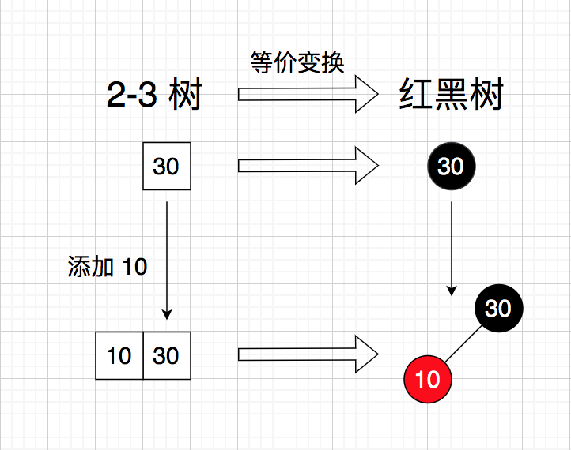

2. 往 2-3 树的 2-节点添加⼤于 2-节点值的新元素。等价于往红⿊树的⿊节点的右⼦树添加新的红节点，再进⾏左旋，将新的红节点变成⿊节点。

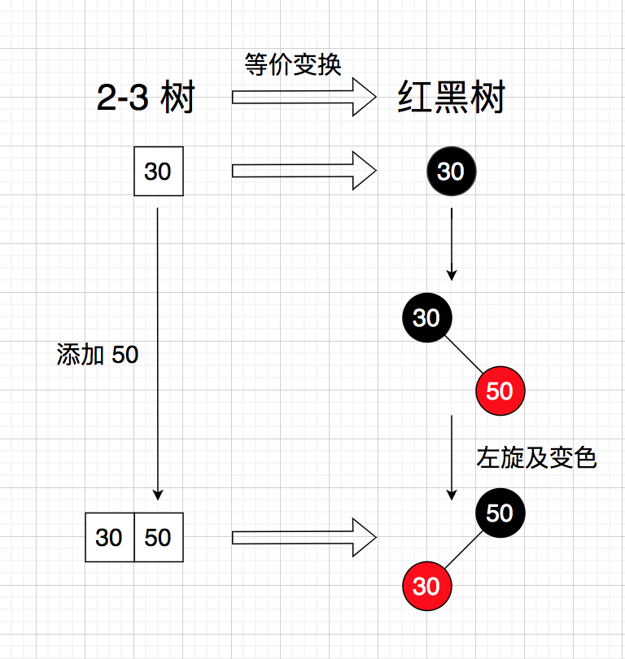

3. 往 2-3 树的 3-节点添加⼩于 3-节点较⼩值的新元素。等价于先往红⿊树的红节点的左⼦树添加新的红节点，再进⾏右旋，最后进⾏颜⾊翻转。

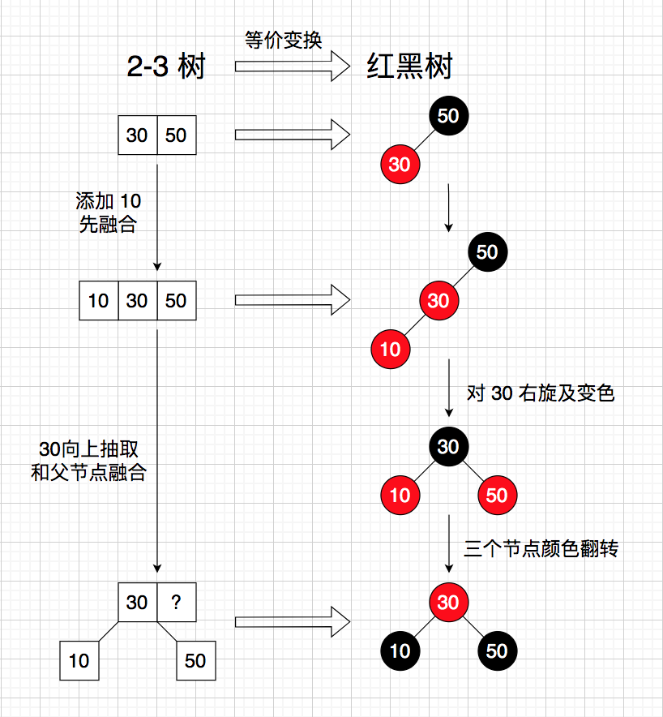

4. 往 2-3 树的 3-节点添加处于3-节点中间值的新元素。等价于先往红⿊树的红节点的右⼦树添加新的红节点，再进⾏左旋，变成了 case3，最后进⾏右旋和颜⾊翻转。

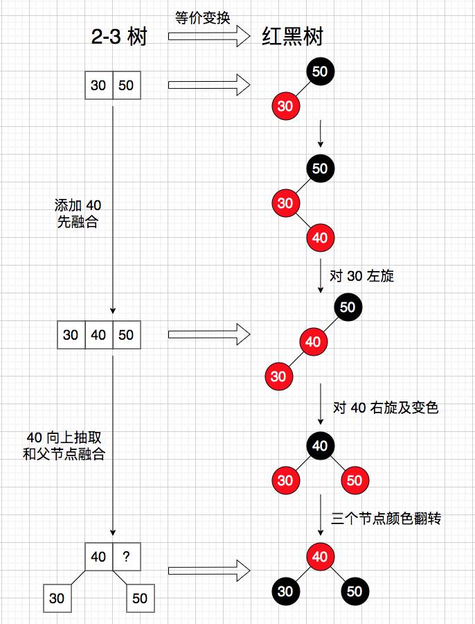

5. 往 2-3 树的 3-节点添加⼤于 3-节点较⼤值的新元素。等价于先往红⿊树的⿊节点的右⼦树添加新的红节点，再进⾏颜⾊翻转。

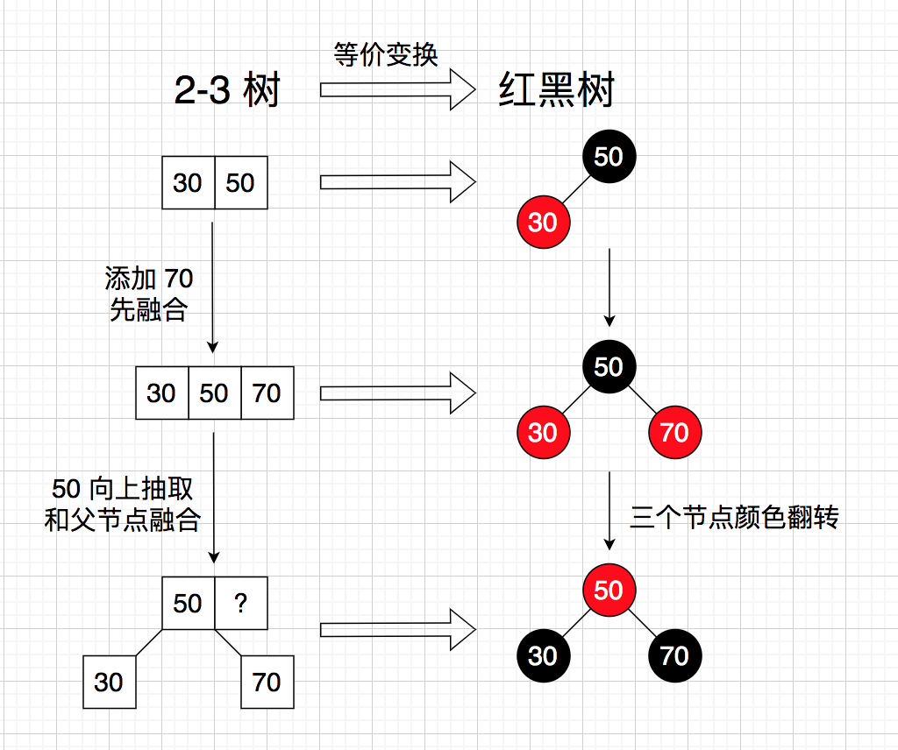

上⾯的 5 种不同情况其实可以抽象成下⾯这⼀连串的操作，只要满⾜相应的条件就执⾏相应的操作。

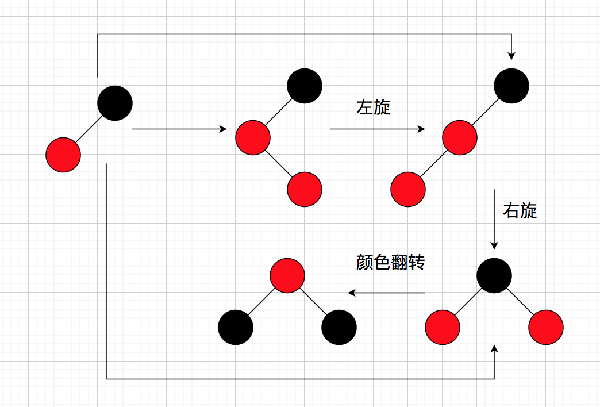

红⿊树的平衡性相较于 AVL 树差⼀些，故查找性能⽐ AVL 树差；但红⿊树⽤部分变⾊替换了旋转操作，故插⼊和删除操作相较于 AVL 树会好⼀些。

### 简单代码实现
下⾯⽤ Java 代码简单实现红⿊树的添加操作，模拟可以添加键值对的 TreeMap。

只贴出部分代码，完整代码可以看[这⾥](https://github.com/kittolin/data-structure/blob/master/src/tree/RedBlackTree.java)。

```java
// Map 集合的 key ⼀定要具有可⽐较性
public class RedBlackTree<K extends Comparable<K>, V> {
    private static final boolean RED = true;
    private static final boolean BLACK = false;

    private class Node {
        public K key;
        public V value;
        public Node left, right;
        public boolean color;
        public Node(K key, V value) {
            this.key = key;
            this.value = value;
            left = right = null;
            color = RED;  // 添加的新节点都是红⾊的
        }
    }

    private Node root;
    private int size;

    // 平均时间复杂度: O(log n)
    // 最坏时间复杂度: O(log n)
    public void add(K key, V value) {
        if (key == null) {
            throw new IllegalArgumentException("Key mustn't be null.");
        }
        root = add(root, key, value);
        root.color = BLACK;  // 根节点⼀定是⿊⾊的
    }

    // 递归过程，以 node 为根节点的⼦树添加键值对，返回添加后的新的⼦树根节点
    private Node add(Node node, K key, V value) {
        // 递归结束条件，也是真正添加新节点的地⽅，红⿊树的新节点⼀定是添加在空的位置
        if (node == null) {
            size ++;
            return new Node(key, value);
        }

        // 常规的⼆分搜索树添加新节点的过程
        // 区别在于红⿊树可能会因为旋转操作导致⼦树的根节点变化，所以需要调整左右指针指向
        if (key.compareTo(node.key) < 0) {
            node.left = add(node.left, key, value);
        } else if (key.compareTo(node.key) > 0) {
            node.right = add(node.right, key, value);
        } else {
            node.value = value;
        }

        // 旋转和变⾊等操作维持红⿊树的平衡
        // 注意不能⽤ elseif，因为在⼀次递归过程中可能需要进⾏多种操作
        if (isRed(node.right) && !isRed(node.left)) {
            node = leftRotate(node);
        }
        if (isRed(node.left) && isRed(node.left.left)) {
            node = rightRotate(node);
        }
        if (isRed(node.left) && isRed(node.right)) {
            flipColors(node);
        }

        return node;
    }

    private boolean isRed(Node node) {
        // 叶⼦节点是⿊⾊的 nil 节点
        if (node == null) {
            return false;
        }
        return node.color == RED;
    }

    /**
     *   node                             x
     *  /   \     leftRotate            /  \
     * T1   x   -------------->      node  T3
     *     / \                      /   \
     *    T2 T3                    T1   T2
     */
    private Node leftRotate(Node node) {
        Node x = node.right;
        node.right = x.left;
        x.left = node;
        x.color = node.color;
        node.color = RED;
        return x;
    }

    /**
     *     node                         x
     *    /   \     rightRotate       /  \
     *   x    T2  -------------->   y   node
     *  / \                             /  \
     * y  T1                           T1  T2
     */
    private Node rightRotate(Node node) {
        Node x = node.left;
        node.left = x.right;
        x.right = node;
        x.color = node.color;
        node.color = RED;
        return x;
    }

    /*
     *    b                   r   
     *   /  \   --------->   /  \
     *  r    r              b    b
     */
    private void flipColors(Node node) {
        node.color = RED;
        node.left.color = BLACK;
        node.right.color = BLACK;
    }
}
```
