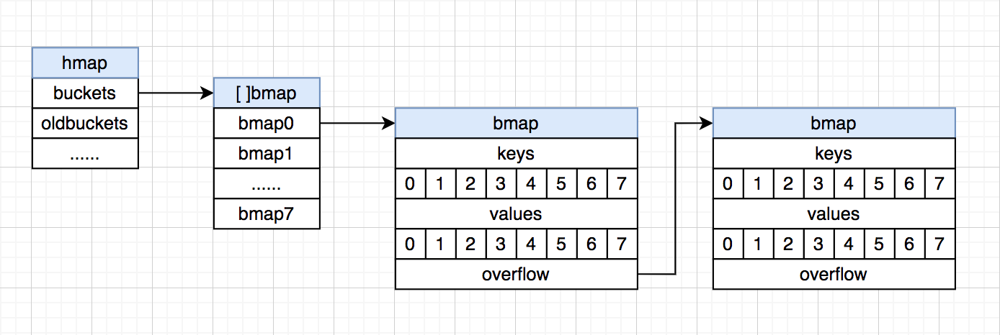

# 哈希表简介及 Go map 底层实现
在平时的编程开发中，经常会⽤到 key-value 集合，⽐如：Go map，Python dict，Java HashMap。

⽤多了，⾃然想探究下它们的底层具体是怎么实现的。

上⾯这三种集合的底层实现都是基于哈希表，所以有必要先了解下哈希表的实现思想。

## 哈希表介绍
### 哈希表是什么
摘⾃维基百科的介绍：

> 散列表（Hash table，也叫哈希表），是根据键（Key）⽽直接访问在内存储存位置的数据结构。也就是说，它通过计算⼀个关于键值的函数，将所需查询的数据映射到表中⼀个位置来访问记录，这加快了查找速度。这个映射函数称做散列函数，存放记录的数组称做散列表。

哈希表的底层数据结构通常采⽤的是数组。

简单来说就是：在存储键值对时，将 key 通过⼀个哈希算法算出哈希值，再通过哈希值快速定位到可以存储的位置；在读取时，也是将 key 通过上⾯的哈希算法算出相同的哈希值，再通过哈希值快速定位到存储位置。

所以，哈希表增删改查的平均时间复杂度都是O(1)。（注意是平均，因为添加操作可能会达到负载因⼦导致扩容）

在哈希表的设计中，通常会涉及到这三个主要概念：哈希算法，哈希冲突，扩容。（有关哈希表的⼀些概念在⽹上都有很详尽的解释了，这⾥只做简单概括）

### 哈希算法
⼀个良好的哈希算法应该要满⾜这个条件：不同的 key 通过该哈希算法算出的哈希值尽可能均匀地分散到数组中的不同位置，这样可以最⼤限度地减少哈希冲突的可能。

常⻅的哈希算法有很多，这⾥只提⼀个最常⽤的，在很多编程语⾔中也⼤致是采⽤的这种思路：
1. 不管 key 是什么数据类型，先将 key 转化成⼀个 32 位的整型数字，这个数字称为哈希值，⽐如 Java 的 Object 类（所有对象的⽗类）有⼀个 hashCode ⽅法，所有数据类型都可以覆盖这个⽅法来实现⾃定义的哈希算法；
2. 然后哈希值对数组⻓度求余数，就能找到键值对在数组中存储的位置了。

### 哈希冲突
即使是最优良的哈希算法也不可能完全避免哈希冲突。

⽐如采⽤上⾯的取余法，两个不同的 key 通过哈希算法算出两个不同的哈希值，这两个哈希值对数组⻓度取余很有可能得到两个相同的余数，则发⽣了哈希冲突，也叫哈希碰撞。

常⽤的解决哈希冲突的⽅法有线性探测法和拉链法等。
- 线性探测法：从冲突的数组下标开始往后探测，直到找到⼀个空位置进⾏存储；查找时，先找到 key 对应的下标，再判断 key 是否相等，不相等的话再继续往后探测判断。
- 拉链法：数组的每个索引位置都各⾃存储着⼀个链表的头指针，冲突的 key 在对应索引位置的链表上再往后添加。Java 和 Go 都是采⽤这种⽅式解决冲突的。

### 扩容
当哈希冲突达到⼀定的阈值(负载因⼦)后，哈希表的增删改查性能会⼤⼤降低。

⽐如采⽤上⾯的拉链法，最坏情况下，所有 key 的哈希值对数组⻓度取余后都得到相同的余数，就会在数组的某个索引位置上形成⼀个⻓⻓的链表，增删改查都达到了O(n)级别。

这时就需要对数组进⾏扩容了，最通常的做法是建⽴⼀个⻓度翻倍的新数组，将原数组的数据重新计算哈希再存到新数组。

这⾥有⼀个值得关注的点。很多编程语⾔⽐如 Go，哈希表数组的初始化⻓度都为 2^n（n 为正整数），扩容都是在原数组⻓度上乘以 2，所以数组的⻓度⼀直都是 2^n，这么做的意义是什么呢？

⼀个整数对 2^n 取余其实等价于这个整数的⼆进制数取后 n 位（可以举⼀些特例推导出来），那么就可以⽤位运算来替代求余运算。

⽐如 15 对 2^3 取余，等价于 15 和 00000111（这个数可以根据 n 计算出来，这⾥ n=3）做位与运算。

位运算的效率⼤⼤⾼于求余运算，所以可以⼤⼤提⾼哈希算法的效率。

## 简单代码实现
明⽩了哈希表的基本思想，那么在不考虑性能和较⾼安全性的情况下，可以写出⼀个简单的哈希表出来。

```java
import java.util.TreeMap;

// 哈希表的 key 必须保证唯⼀性和可⽐较性
public class HashTable<K extends Comparable<K>, V> {
    // 有哈希表相关实验表明，哈希表数组⻓度取素数可以使哈希值分布地更均匀，这⾥⽤素数替代 2 ^ n 作为数组⻓度
    private static final int[] CAPACITIES = {
            53, 97, 193, 389, 769, 1543, 3079, 6151, 12289, 24593, 49157,
            98317, 196613, 393241, 786433, 1572869, 3145739, 6291469, 12582917,
            25165843, 50331653, 100663319, 201326611, 402653189, 805306457, 1610612741
    };

    private static final int UPPER = 10;  // 扩容上界，平均每个索引位置的元素个数超过 UPPER 就扩容
    private static final int LOWER = 2;   // 缩容下界，平均每个索引位置的元素个数少于 LOWER 就缩容
    private TreeMap<K, V>[] table;        // 数组每个索引位置都保存⼀棵红⿊树⽽不采⽤链表
    private int size;                     // 哈希表存储的所有元素个数
    private int capacity;                 // 哈希表数组⻓度
    private int capacityIndex;            // 哈希表数组⻓度在 CAPACITIES 中的索引

    // 初始化⼀个最⼩容量的哈希表
    public HashTable() {
        capacityIndex = 0;
        capacity = CAPACITIES[capacityIndex];
        size = 0;
        table = new TreeMap[capacity];
        for (int i = 0; i < capacity; i++) {
            table[i] = new TreeMap<>();
        }
    }

    // 哈希算法，对数组⻓度取余，位与 0x7fffffff 可以保证哈希值为正数
    private int hash(K key) {
        return (key.hashCode() & 0x7fffffff) % capacity;
    }

    // 扩缩容，将原数组的键值对重新计算哈希存⼊新数组
    private void resize(int newCapacity) {
        TreeMap<K, V>[] newTable = new TreeMap[newCapacity];
        for (int i = 0; i < newCapacity; i++) {
            newTable[i] = new TreeMap<>();
        }
        capacity = newCapacity;
        for (int i = 0; i < table.length; i++) {
            TreeMap<K, V> map = table[i];
            for (K key: map.keySet()) {
                newTable[hash(key)].put(key, map.get(key));
            }
        }
        table = newTable;
    }

    public int getSize() {
        return size;
    }

    // 添加键值对，如果 key 不存在就添加，key 已存在就覆盖更新
    public void add(K key, V value) {
        if (key == null) {
            throw new IllegalArgumentException("Key mustn't be null.");
        }
        TreeMap<K, V> map = table[hash(key)];
        if (map.containsKey(key)) {
            map.put(key, value);
        } else {
            map.put(key, value);
            size ++;
            // 符合扩容条件进⾏扩容
            if (size >= UPPER * capacity && capacityIndex + 1 < CAPACITIES.length) {
                capacityIndex ++;
                resize(CAPACITIES[capacityIndex]);
            }
        }
    }

    // 删除键值对
    public V remove(K key) {
        if (key == null) {
            throw new IllegalArgumentException("Key mustn't be null.");
        }
        V ret = null;
        TreeMap<K, V> map = table[hash(key)];
        if (map.containsKey(key)) {
            ret = map.remove(key);
            size --;
            // 符合缩容条件进⾏缩容
            if (size < LOWER * capacity && capacityIndex - 1 >= 0) {
                capacityIndex --;
                resize(CAPACITIES[capacityIndex]);
            }
        }
        return ret;
    }

    // 更新键值对
    public void set(K key, V newValue) {
        if (key == null) {
            throw new IllegalArgumentException("Key mustn't be null.");
        }
        TreeMap<K, V> map = table[hash(key)];
        if (!map.containsKey(key)) {
            throw new IllegalArgumentException(key + "doesn't exist.");
        }
        map.put(key, newValue);
    }

    // 判断哈希表是否存在某个 key
    public boolean contains(K key) {
        if (key == null) {
            throw new IllegalArgumentException("Key mustn't be null.");
        }
        return table[hash(key)].containsKey(key);
    }

    // 根据 key 获取 value
    public V get(K key) {
        if (key == null) {
            throw new IllegalArgumentException("Key mustn't be null.");
        }
        return table[hash(key)].get(key);
    }
}
```

## Go map 底层实现
编程语⾔中是如何实现⼀个⾼性能⾼可⽤的 map 集合呢？下⾯以 Go 15.1 的 map 底层实现为例进⾏分析。map 的源码位于 src/runtime/map.go。

### 基本结构
hmap 结构体表⽰整个哈希表结构，主要的属性如下：

```go
// A header for a Go map.
type hmap struct {
    count     int             // 键值对个数
    flags     uint8
    B         uint8           // 哈希表数组的⻓度为 2^B，B 就是上⾯所讲的 n，可以通过位运算替代求余运算
    noverflow uint16
    hash0     uint32
    buckets    unsafe.Pointer // 指向 bucket 数组
    oldbuckets unsafe.Pointer // 指向扩容前的原 bucket 数组，⽤于延迟扩容，后⾯会讲
    nevacuate  uintptr
    extra *mapextra
}
```

Go map 多封装了⼀层概念 bucket，bmap 结构体就表⽰ bucket。

在每个 bucket 中可以存储 8 个键值对，这点不同于 Java HashMap 的⼀个节点只能存储⼀个键值对；当 bucket 的键值对超过 8 时，会创建⼀个新的可以存储 8 个键值对的 bucket，链接在当前 bucket 的 overflow 指针上，以此类推，形成链表。

bucket 中键值对的存储并不是以 k1v1,k2v2... 的形式，⽽是 k1k2...v1v2... 的形式，即键值对分开存储，这么做有什么意义呢？

⽐如 map[int64]int8，k 和 v 的字节⻓度不同，如果按 kv 形式存储，则由于内存对⻬ v 也会占⽤ 8 个字节的空间；⽽如果按键值对分开存储，则 v 只需要占⽤ 1 个字节空间，减少内存消耗。

除此之外，bucket 中还有⼀个⻓度为 8 的 tophash 数组，存储 8 个键的哈希值的⾼ 8 位，⽤于快速检索某个键在 bucket 中是否存在。

kv 的存储结构和 overflow 指针，在 bmap 结构体中并没有显式定义，⽽是通过指针运算来进⾏访问的。

```go
// A bucket for a Go map.
type bmap struct {
    // tophash generally contains the top byte of the hash value
    // for each key in this bucket. If tophash[0] < minTopHash,
    // tophash[0] is a bucket evacuation state instead.
    tophash [bucketCnt]uint8
    // Followed by bucketCnt keys and then bucketCnt elems.
    // NOTE: packing all the keys together and then all the elems together makes the
    // code a bit more complicated than alternating key/elem/key/elem/... but it allows
    // us to eliminate padding which would be needed for, e.g., map[int64]int8.
    // Followed by an overflow pointer.
}
```

⽤⼀张图来表⽰ hmap 和 bmap 的结构：



### 哈希算法
map 的增删改查过程⼤致类似，都是将 key 通过哈希算法算出具体应该存储的 bucket。假设 B=4，数组的初始⼤⼩为 2^4=16，map 的哈希算法过程如下：
1. 计算出 key 的 32 位哈希值；
2. ⽤位与运算替代求余运算，取 32 位哈希值的最后 4 位，定位到数组的某个索引位置上；
3. 取 32 位哈希值的前 8 位，在当前索引位置上的 bucket 的 tophash 数组中快速检索⽐对；
4. 如果有匹配的，再对比对应格⼦位置的 key 的完整 hash 是否匹配，如果也匹配，则可以获取对应格⼦位置的 value；(第 3 步的 tophash 可以理解成是⼀种缓存措施，先⽐对哈希值的 前 8 位，不⽤每次都完整⽐对整个 32 位哈希值)
5. 如果在当前 bucket 中都没有找到匹配的，则通过当前 bucket 的 overflow 指针往后⾯的 bucket 继续查找，以此类推。

### 扩容
当 Go map 的元素增⻓到超过负载因⼦（默认为 6.5）时，就需要进⾏扩容了。

扩容过程是：先创建⼀个新的两倍⻓度的数组替换掉原数组，然后⽤ oldbuckets 指针指向原数组，保证原先数据不丢失。

不同于 Java HashMap 的⽴即迁移，Go map 的元素迁移是惰性的，只有对某个 bucket 进⾏访问操作时才会迁移该 bucket 中的键值对，这么做的好处是不会因为整个数组的复制⽽导致阻塞 很⻓的时间。

随着不断地访问操作，最终完成整个 hmap 的 oldbuckets 到 buckets 的元素迁移。

## 总结
哈希表的基本思想其实很简单，但要具体实现⼀个⾼性能⾼可⽤的哈希表却不是件容易事。

⽐如数组的初始⻓度和扩容⻓度的确定，哈希算法的设计等，负载因⼦的确定也是在不断实践的过程中得出的，这里面的每⼀点概念都还有值得继续深究的地⽅。

## 参考资料
- [散列表维基百科](https://zh.wikipedia.org/zh-hans/%E5%93%88%E5%B8%8C%E8%A1%A8)
- [大话图解 golang map](https://www.cnblogs.com/linkstar/p/10969631.html)
