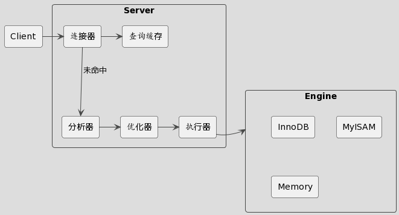

# MySQL 底层实现和死锁问题分析

MySQL 应该是我们平时开发中用的最多的中间件了。它的 SQL 功能非常强大，一条简单的 SQL 语句背后，隐含了很多复杂而巧妙的设计思想。

本文主要分享 MySQL 中两个重要且巧妙的底层实现：事务的隔离性，update 语句的执行流程。这其中涉及到了 MySQL 的三大日志：binlog、redo log 和 undo log。这些日志是 MySQL 实现高性能和一致性的保证，也是组建主从和主备架构的前提基础。

最后再分享几个常见的死锁问题。基于此，了解下 SQL 执行背后的加锁逻辑，以及可以如何通过日志来分析定位这些问题，在以后开发中如何规避。

首先，先来看一下 MySQL 的基础架构。

## 基础架构

MySQL 整体架构如下所示，主要包含两大组件：server 层和存储引擎层。

server 层又包含多个组件，负责 SQL 的检查和解析，所有跨存储引擎的功能都在这一层实现。

- 连接器：管理客户端连接，权限校验等
- 分析器：词法和语法分析
- 优化器：选择索引，生成执行计划
- 执行器：调用存储引擎接口来读写数据

存储引擎层是实际的数据存取层，这一层已经没有 SQL 的概念了。引擎层是插件式的，可以接入多种不同的引擎。

总结来说就是，经过 server 层的检测和 SQL 解析后，由执行器调用具体的存储引擎接口来完成数据读写。

## 事务隔离是如何实现的

1、引言，ACID，隔离级别

2、例子解释 可重复读

3、undo log

4、视图数组

5、具体实现，例子

https://xiaolincoding.com/mysql/transaction/mvcc.html
https://tech.meituan.com/2014/08/20/innodb-lock.html

undo log 如何实现
数据每个版本的row_trx_id字段存储在哪

## update 语句背后都做了什么

## 死锁问题分析

## 参考资料
