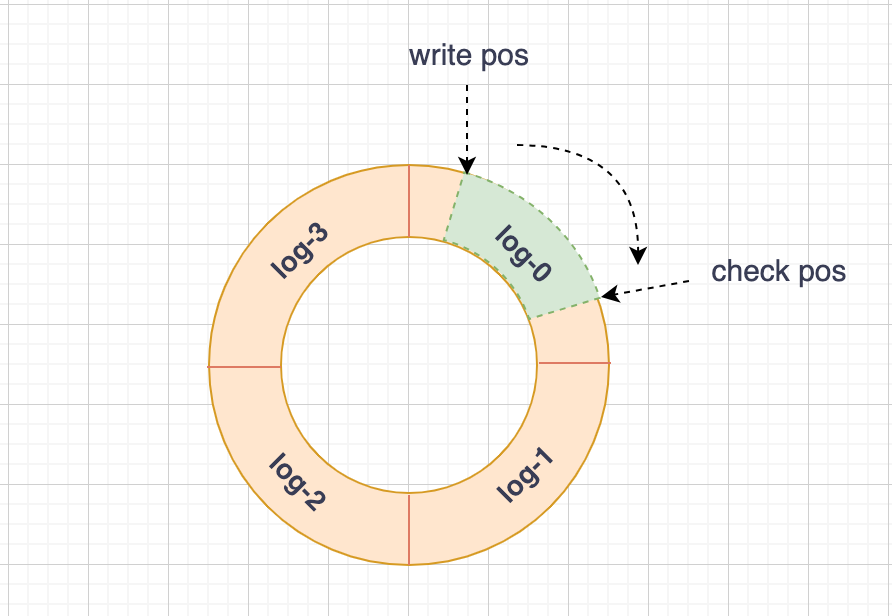
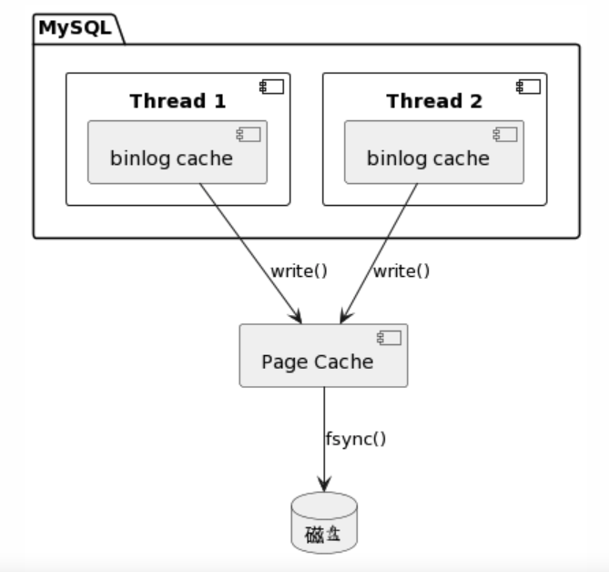

# MySQL 底层实现和死锁问题分析

MySQL 应该是我们平时开发中用的最多的中间件了。它的 SQL 功能非常强大，一条简单的 SQL 语句背后，隐含了很多复杂而巧妙的设计思想。

本文主要分享 MySQL 中两个重要且巧妙的底层实现：事务的隔离性，update 语句的执行流程。这其中涉及到了 MySQL 的三大日志：binlog、redo log 和 undo log。这些日志是 MySQL 实现高性能和一致性的保证，也是组建主从和主备架构的前提基础。

最后再分享几个常见的死锁问题。基于此，了解下 SQL 执行背后的加锁逻辑，以及可以如何通过日志来分析定位这些问题，在以后开发中如何规避。

首先，先来看一下 MySQL 的基础架构。

## 基础架构

MySQL 整体架构如下所示，主要包含两大组件：server 层和存储引擎层。


server 层又包含多个组件，负责 SQL 的检查和解析，所有跨存储引擎的功能都在这一层实现。

- 连接器：管理客户端连接，权限校验等
- 分析器：词法和语法分析
- 优化器：选择索引，生成执行计划
- 执行器：调用存储引擎接口来读写数据

存储引擎层是实际的数据存取层，这一层已经没有 SQL 的概念了。引擎层是插件式的，可以接入多种不同的引擎。

总结来说就是，经过 server 层的检测和 SQL 解析后，由执行器调用具体的存储引擎接口来完成数据读写。

## 事务隔离是如何实现的

事务，是我们使用 MySQL 过程中经常听到的词了，也是 MySQL 最为亮点的设计之一了。事务有 ACID 四大特性，这里主要以 MySQL 默认隔离级别 REPEATABLE READ（可重复读）来分享下隔离性的底层实现机制。

可重复读：在同一个事务内，多次读取相同数据时，结果保持一致，期间其他事务提交的更改对当前事务不可见。

来看下一个例子。假设有一张 account 表存储用户余额，有两个字段 user_id 和 money，初始时有一条 user_id = 1 && money = 100 的记录。下图的 S1 和 S2 都表示同一条查询语句，U1 和 U2 都表示同一条更新语句，sql 如下：

```sql
select money from account where user_id = 1;

update account set money = money + 100 where user_id = 1;
```


分析下 S1 的取值，先给出结论：S1 = 100，可以从两个角度来看：

1. S1 查询时事务 A 还未提交，S1 得到的结果应该和事务 A 刚启动时是一样的，即初值 100；
2. S1 如果能看到 U1 的变更，即读取到了事务 B 提交的数据，这种情况属于不可重复读；S1 如果能看到 U2 的变更，即读取到了事务 C 未提交的数据，这种情况属于脏读。而可重复读级别可以避免脏读和不可重复读。

S2 的分析同 S1，结果也为 100；S3 是在事务 A 提交后，能看到 U1 和 U2 的变更，结果为 300。

### MVCC 机制

事务 A 读取到的值是 100，事务 B 在 U1 变更后读取到的值为 200，事务 C 在 U2 变更后读取到的值为 300，就好像这一行数据有三个版本，三个事务能分别读取到对应的版本。

的确，在 MySQL 里面每一行记录是可以存在有多个版本的，每次变更都会重新生成一个新的版本，同时记录下此次变更所属的事务 ID，如下图所示：


在具体实现上，MySQL 是通过 undo log 机制来模拟出多个版本的，上图的箭头 u1 和 u2 就是指的 undo log。

u1 和 u2 记录的内容可以分别理解为： 将 300 改为 100，将 400 改为 300，然后当前 V3 的 400 再通过 u2 和 u1 的回溯就能得到 V1 的 100 了。

也就是说，V1 和 V2 并不是真实存在的，而是 V3 通过真实存在的 u1 和 u2 来回溯模拟出来的。

这一机制，就是 MySQL 中经典的 MVCC 机制（多版本并发控制）。

### 一致性视图

有了 undo log，每行记录就可以从当前版本回溯到之前的任意版本了，那么每个事务又是如何确定自己应该回溯到具体哪个版本呢？这里就要引入一致性视图（read-view）的概念了。

在可重复读隔离级别下，视图是在事务启动时创建的，整个事务期间都使用该视图，即视图在整个事务内都是静态的不变的。

- 每个事务对应一个数组，保存着该事务启动时正在活跃的事务 ID，即仍在运行未提交的事务
- 低水位：上述数组里面最小的事务 ID
- 高水位：当前系统创建过的事务 ID 的最大值加 1，即应该给下一个事务分配的 ID，注意不是数组里面最大的事务 ID

### 数据可见性规则

视图数组加上高低水位，就把每行记录的多个版本分成了三个区间，每个区间内的数据版本对于当前事务是否可见的规则并不相同，具体如下：

- 若数据版本的 trx_id 小于低水位，表明该版本是由当前事务启动前的其他事务生成的，并且一定提交了的，故可见（规则 1）
- 若版本的 trx_id 大于或等于高水位，表明该版本是由当前事务启动后的事务生成的，不管提交与否，一定不可见（规则 2）
- 若版本的 trx_id 位于高低水位之间，分两种情况
  - 版本的 trx_id 在数组里面，表明该版本是由当前事务启动时正活跃的事务生成的，不管提交与否，一定不可见（规则 3）
  - 版本的 trx_id 不在数组里面，表明该版本是由当前事务启动前的其他事务生成的，且一定提交了，故可见（规则 4）

从记录的当前版本出发，一直回溯到第一个可见的版本，就是当前事务应该看到的记录的版本。

我们还是用刚才演示可重复读的例子，利用可见性规则来分析下 S1、S2 和 S3 的取值。

不妨假设事务 A、B、C 的事务 ID 分别为 31、32、30，有两个 ID 分别为 10、20 的活跃事务贯穿于整个期间，user_id = 1 的记录是由先前已提交的 ID 为 5 的事务创建的，则 A、B、C 的一致性视图如下所示：


在 S1 查询前，已经有了 U1 和 U2 两次变更，则 user_id = 1 的记录当前存在有三个版本了：


S1 的取值分析过程如下：

- 当前版本 money = 300，trx_id 位于事务 A 的高低水位间，且在 A 的数组中，符合规则 3，不可见，往前找
- money = 200 的版本，trx_id 等于高水位，符合规则 2，不可见，继续往前找
- money = 100 的版本，trx_id 小于低水位，符合规则 1，可见，故 S1 取值为 100

S2 的分析同 S1。S3 查询时，事务 A 已提交，S3 单次查询也是个新事务，假设新事务 ID 为 33，视图如下所示：


S3 的取值分析过程如下：

- 当前版本 money = 300，trx_id 位于事务 A2 的高低水位间，且不在 A2 的数组中，符合规则 4，可见，故 S3 取值为 300

## update 语句背后都做了什么

再来看下 update 语句是如何执行的。每次 update 都要写磁盘吗？并不是的，这样性能太差了，根本支持不了高并发。要想理解 update 的执行流程，需要先了解下两个关键日志：redo log、binlog。

### redo log

redo log 是 InnoDB 引擎特有的日志，确保了数据库的持久性和一致性，主要用于 MySQL 的崩溃恢复。

redo log 是物理日志，因为其是引擎内部日志，所以是没有 sql 语句和记录之类的概念的，记录的内容大致类似于 “在某数据页的某一偏移量上做了什么修改”。

这里你可能有疑问了：数据文件保存在磁盘，日志文件也是保存在磁盘，同样是写磁盘，为什么不直接写数据文件，还要多此一举呢？

比如执行如下 update 语句：
```sql
update account set money = money + 100 where user_id = 1;
```
如果是直接写数据文件，首先要读磁盘找到 user_id = 1 的记录，更新 money 字段后，再写回磁盘，属于随机读写；
如果是写日志文件，不用关心记录的具体位置，只需在日志文件后面追加日志，属于顺序写，磁盘的顺序写性能远大于随机写。

只要写了 redo log 日志，更新就算完成了；InnoDB 会在适当的时候将日志的变更刷新到磁盘的数据文件里去。

redo log 由多个文件组成，写过程类似于循环队列的循环写，如下图所示：
- write pos 表示当前日志接下来要写的位置
- check pos 表示已刷新到磁盘的日志的位置
- 图中绿色部分表示接下来日志可以写入的，黄色部分表示已写入但还未刷新到磁盘的



在具体实现上，日志是先写到 buffer 的，可配置相关参数，在事务提交时将 buffer 日志刷到磁盘去；
此外，InnoDB 还有个后台线程，定时刷 buffer 到磁盘。

### binlog

binlog 是 Server 层实现的，故所有引擎都可以使用，用于记录数据库的所有增删改操作。只要日志齐全，就可以用其重放出一个完全一样的数据库。

binlog 是逻辑日志，记录的是 sql 语句的原始逻辑，类似于 “给 user_id = 1 的记录的 money 字段加 100”。

binlog 日志写磁盘的过程如下图所示：
- 为了保证事务日志的原子性，每个线程都有其单独的 cache，在事务提交时，用 write 系统调用一次性刷到 page cache 去
- 至于何时如何调用 fsync 写到磁盘，可通过 sync_binlog 参数配置



binlog 和 redo log 的对比如下：

|       | redo log | binlog |
| ---   | -------- | ------ |
| 实现层 | InnoDB | Server |
| 日志类型 | 物理日志 | 逻辑日志 |
| 写机制 | 循环写 | 追加写 |
| 用途 | 故障恢复 | 主从复制、备份还原 |

### 两阶段提交

update 语句主要做了三件事：更新 buffer pool，写 redo log，写 binlog。

由于 redo log 和 binlog 是两个独立的逻辑，为了保证日志和数据的一致性，MySQL 采用了两阶段提交机制，具体流程如下图所示：


MySQL 重启后会去扫描 redo log 文件，分三种情况进行处理：
- redo log 里面事务完整，即有 commit 标识，则直接提交（情况 1）
- redo log 里面事务不完整，只有 prepare，则去判断对应的 binlog 是否完整存在
  - 若是，则提交事务（情况 2）
  - 否则，回滚事务（情况 3）

假设 MySQL 分别在 update 执行过程中的各个中间时间点崩溃了，来分析下重启后是如何进行恢复的。
- t1 时崩溃，redo log 和 binlog 都还未写，故一致；重启后内存的新数据丢失，从磁盘载入旧数据，update 执行不生效
- t2 时崩溃，符合情况 3，回滚事务，update 执行不生效
- t3 时崩溃，符合情况 2，提交事务，update 执行生效

可见，只要 redo log 写了 prepare 标识，且 binlog 正常写入了，此时更新操作就算生效了，后续的 commit 标识更新是否完成也不影响结果的。

## 死锁问题分析

长事务意味着系统里面会存在很老的事务视图。由于这些事务随时可能访问数据库里面的任何数据，所以这个事务提交之前，数据库里面它可能用到的回滚记录都必须保留，这就会导致大量占用存储空间。

可重复读的核心就是一致性读（consistent read）；而事务更新数据的时候，只能用当前读。如果当前的记录的行锁被其他事务占用的话，就需要进入锁等待。

问题：
undo log 如何实现
高水位是事务创建时确定的，还是一直变的

两阶段锁

笔记：
幻读和间隙锁
数据库锁

## 参考资料
