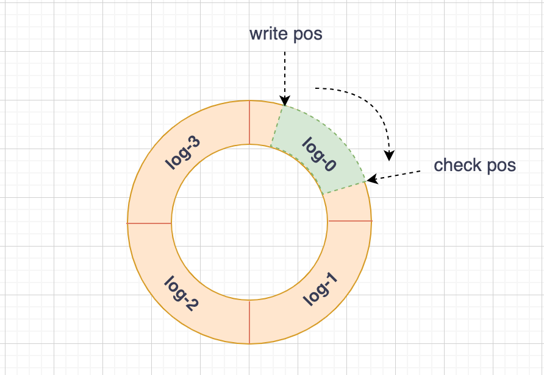
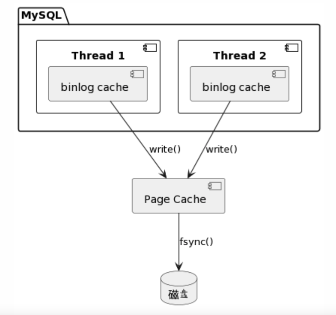
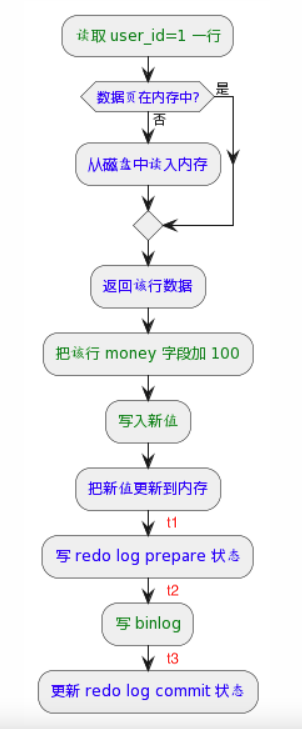

# MySQL update 语句的执行流程

本文主要分享 MySQL 中 update 语句的执行流程，这其中涉及到了 MySQL 的三大日志：binlog、redo log 和 undo log。这些日志是 MySQL 实现高性能和一致性的保证，也是组建主从和主备架构的前提基础。

update 语句每次都要写磁盘吗？并不是的，这样性能太差了，根本支持不了高并发。要想理解 update 的执行流程，需要先了解下两个关键日志：redo log、binlog。

## redo log

redo log 是 InnoDB 引擎特有的日志，确保了数据库的持久性和一致性，主要用于 MySQL 的崩溃恢复。

redo log 是物理日志，因为其是引擎内部日志，所以是没有 sql 语句和记录之类的概念的，记录的内容大致类似于 “在某数据页的某一偏移量上做了什么修改”。

这里你可能有疑问了：数据文件保存在磁盘，日志文件也是保存在磁盘，同样是写磁盘，为什么不直接写数据文件，还要多此一举呢？

比如执行如下 update 语句：

```sql
update account set money = money + 100 where user_id = 1;
```

如果是直接写数据文件，首先要读磁盘找到 user_id = 1 的记录，更新 money 字段后，再写回磁盘，属于随机读写；
如果是写日志文件，不用关心记录的具体位置，只需在日志文件后面追加日志，属于顺序写，磁盘的顺序写性能远大于随机写。

只要写了 redo log 日志，更新就算完成了；InnoDB 会在适当的时候将日志的变更刷新到磁盘的数据文件里去。

redo log 由多个文件组成，写过程类似于循环队列的循环写，如下图所示：

- write pos 表示当前日志接下来要写的位置
- check pos 表示已刷新到磁盘的日志的位置
- 图中绿色部分表示接下来日志可以写入的，黄色部分表示已写入但还未刷新到磁盘的



在具体实现上，日志是先写到 buffer 的，可配置相关参数，在事务提交时将 buffer 日志刷到磁盘去；
此外，InnoDB 还有个后台线程，定时刷 buffer 到磁盘。

## binlog

binlog 是 Server 层实现的，故所有引擎都可以使用，用于记录数据库的所有增删改操作。只要日志齐全，就可以用其重放出一个完全一样的数据库。

binlog 是逻辑日志，记录的是 sql 语句的原始逻辑，类似于 “给 user_id = 1 的记录的 money 字段加 100”。

binlog 日志写磁盘的过程如下图所示：

- 为了保证事务日志的原子性，每个线程都有其单独的 cache，在事务提交时，用 write 系统调用一次性刷到 page cache 去
- 至于何时如何调用 fsync 写到磁盘，可通过 sync_binlog 参数配置



binlog 和 redo log 的对比如下：

|          | redo log | binlog             |
| -------- | -------- | ------------------ |
| 实现层   | InnoDB   | Server             |
| 日志类型 | 物理日志 | 逻辑日志           |
| 写机制   | 循环写   | 追加写             |
| 用途     | 故障恢复 | 主从复制、备份还原 |

## 两阶段提交

update 语句主要做了三件事：更新 buffer pool，写 redo log，写 binlog。

由于 redo log 和 binlog 是两个独立的逻辑，为了保证日志和数据的一致性，MySQL 采用了两阶段提交机制，具体流程如下图所示：



MySQL 重启后会去扫描 redo log 文件，分三种情况进行处理：

- redo log 里面事务完整，即有 commit 标识，则直接提交（情况 1）
- redo log 里面事务不完整，只有 prepare，则去判断对应的 binlog 是否完整存在
  - 若是，则提交事务（情况 2）
  - 否则，回滚事务（情况 3）

假设 MySQL 分别在 update 执行过程中的各个中间时间点崩溃了，来分析下重启后是如何进行恢复的。

- t1 时崩溃，redo log 和 binlog 都还未写，故一致；重启后内存的新数据丢失，从磁盘载入旧数据，update 执行不生效
- t2 时崩溃，符合情况 3，回滚事务，update 执行不生效
- t3 时崩溃，符合情况 2，提交事务，update 执行生效

可见，只要 redo log 写了 prepare 标识，且 binlog 正常写入了，此时更新操作就算生效了，后续的 commit 标识更新是否完成也不影响结果的。

## 参考资料
- [MySQL 实战 45 讲](https://time.geekbang.org/column/intro/100020801?tab=catalog)
