# MySQL 死锁问题分析

本文分享几个 Mysql 中的死锁问题。基于此，了解下 SQL 执行背后的加锁逻辑，以及可以如何通过日志来分析定位这些问题，在以后开发中如何规避。

平时使用 MySQL 过程中有可能遇到过这种错误：ERROR 1213 (40001): Deadlock found when trying to get lock; try restarting transaction。

这是数据库多个并发事务之间发生了死锁。那么死锁是什么，如何发生的，以及如何规避呢？

## 死锁是什么

死锁是两个及以上并发操作在互相等待对方释放资源的情况下发生的一种阻塞状态。举个例子，有进程 A、B 都需要申请资源 1、2，A 已拥有 1，在申请 2；B 已拥有 2，在申请 1。A、B 互相阻塞，都无法往下执行，就发生了死锁。

死锁有以下四个必要条件，即如果发生了死锁，这四种情况一定存在：

- 互斥条件：对互斥资源的争抢
- 不剥夺条件：资源只能主动释放，不能被强行夺走
- 请求和保持条件：进程请求的资源被其他占用，又对自己占用的资源保持不放
- 循环等待条件：存在至少一种资源的循环等待链

所以只要破坏了至少一个条件，就一定不会发生死锁。应用到 MySQL 上，前两个条件无法避免，可以通过破坏后两个条件来规避死锁的发生。

在举例之前，还需要先了解下两个概念：两阶段锁和 next-key lock。

- 两阶段锁：InnoDB 事务中，行锁是在需要时才加上的，而要等到事务结束时才统一释放
- next-key lock
  - 间隙锁：当某个事务获取了间隙锁，则锁定一个具体范围，其他事务无法在该范围内插入记录；多个事务可对同一范围同时加间隙锁；间隙锁只在可重复读级别下存在
  - 间隙锁和行锁合称 next-key lock，是前开后闭区间。比如主键 id 上的 next-key lock (5, 10]，表示间隙锁 (5, 10)，以及 id=10 的行锁

下面通过三个例子，来演示下 MySQL 中死锁的发生过程，以及如何规避。演示环境：MySQL 8.0.30，可重复读隔离级别，Innodb 引擎

## 用户佩戴装饰
有一张用户装饰表，记录用户所拥有的装饰，以及正在佩戴的。每个用户可拥有多个装饰，但只能佩戴其中一个。当前表中用户 1 拥有装饰 1、2、3，且佩戴装饰 1。初始化数据如下：

```sql
create table `user_decoration` (
  `id` int(11) auto_increment,
  `user_id` int(11) comment '用户 id',
  `decoration_id` int(11) comment '装饰 id',
  `is_wear` tinyint(4) comment '是否佩戴',
  primary key (`id`),
  unique key `idx_user_id_decoration_id` (`user_id`, `decoration_id`)
) comment '用户装饰表';

insert into `user_decoration` (`user_id`, `decoration_id`, `is_wear`) values
(1, 1, 1),
(1, 2, 0),
(1, 3, 0);
```

假设有并发事务 A、B，分别将用户 1 当前佩戴的装饰改成 2 和 3，执行序列如下所示，发生了死锁。
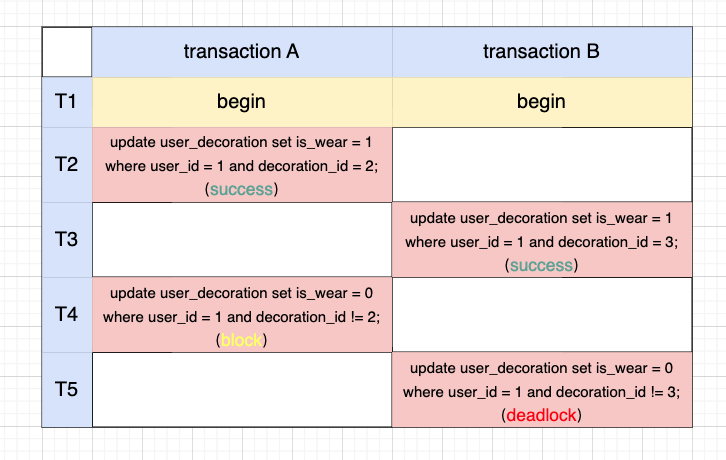

<!-- original:
transaction A
update user_decoration set is_wear = 1 where user_id = 1 and decoration_id = 2;
update user_decoration set is_wear = 0 where user_id = 1 and decoration_id != 2;

transaction B
update user_decoration set is_wear = 1 where user_id = 1 and decoration_id = 3;
update user_decoration set is_wear = 0 where user_id = 1 and decoration_id != 3;


hotfix:
transaction A
update user_decoration set is_wear = 0 where user_id = 1;
update user_decoration set is_wear = 1 where user_id = 1 and decoration_id = 2;

transaction B
update user_decoration set is_wear = 0 where user_id = 1;
update user_decoration set is_wear = 1 where user_id = 1 and decoration_id = 3; -->

MySQL 中可以通过 data_locks 表来查看 sql 执行时加了哪些锁。重点看下 LOCK_MODE 字段：

- X：next-key 锁，此时 LOCK_DATA 表示区间右端点
- X, REC_NOT_GAP：行锁
- X, GAP：间隙锁，此时 LOCK_DATA 表示区间右端点

```sql
select * from performance_schema.data_locks\G;
```

来看下事务 A T2 时刻执行的 sql 加了哪些锁。可以看到，除了在索引 idx_user_id_decoration_id 上加了 1,2 的行锁，还会回表在主键索引上加 id = 2 的行锁。主键上的锁不影响下面的分析，故不再提及。
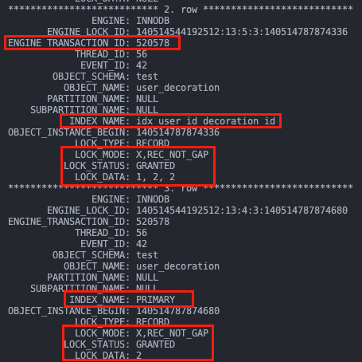

同理，事务 B T3 时刻在索引 idx_user_id_decoration_id 上加了 1,3 的行锁。

再来看事务 A T4 时刻为什么会阻塞。可以看到，事务 A 在 waiting 事务 B 所占据的索引 idx_user_id_decoration_id 上的 1, 3 next-key 锁。
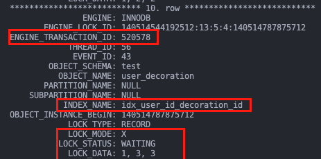

至此，发生死锁的原因可以解释了：

- A 占据了装饰 2 的锁，在等装饰 3 的锁；
- B 占据了装饰 3 的锁，在等装饰 2 的锁

那么，可以如何规避这个死锁的发生呢？

如果是在一开始表设计阶段，可以考虑将这张表拆分成两张表：用户拥有的所有装饰，用户当前正在佩戴的装饰。
这样事务 A、B 的业务逻辑就是更改第二张表的同一记录，只需争抢一个资源，破坏了请求和保持条件，自然不会发生死锁了。

如果该表已在线上运行，可以在不变更表结构的前提下，通过改 sql 来避免吗？
观察分析可以看到，A 和 B 在整个事务期间都需要同时获取用户 1 的所有装饰的锁的。
那么是否可以在事务一开始就先占据所有需要的锁，后续就不会再因为请求锁而被阻塞，也就破坏了请求和保持条件。

基于此想法，变更之后的 sql 如下，A 在 T2 时刻就同时占据了装饰 1、2、3 的锁，B 在 T3 时刻就只能阻塞，直到 A 提交事务释放锁。
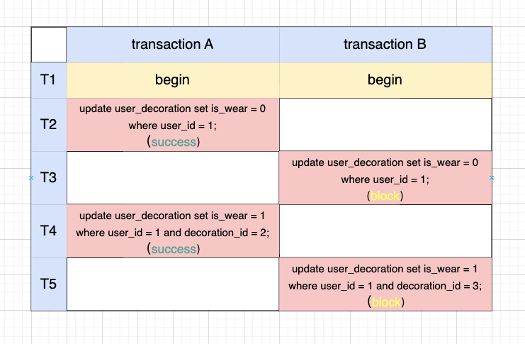

## 互相转账
有一张账户表，用于存储用户的余额，转账采用转出者先扣费、转入者再入账的执行逻辑，初始数据如下：

```sql
create table `account` (
  `id` int(11) comment '账户 id',
  `money` int(11) comment '余额',
  primary key (`id`)
) comment '账户表';

insert into `account` (`id`, `money`) values
(1, 1000),
(3, 3000);
```

<!-- original
transaction A
update `account` set money=money - 100 where id = 1;
update `account` set money=money + 100 where id = 3;

transaction B
update `account` set money=money - 300 where id = 3;
update `account` set money=money + 300 where id = 1;


hotfix
transaction A
update `account` set money=money - 100 where id = 1;
update `account` set money=money + 100 where id = 3;

transaction B
update `account` set money=money + 300 where id = 1;
update `account` set money=money - 300 where id = 3; -->

现在用户 1 向 3 转账 100，3 向 1 转账 300，两个事务并发执行，发生了死锁。
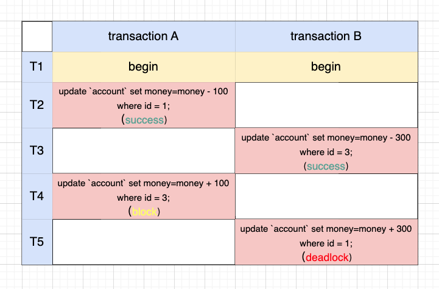

还是通过 data_locks 表来查看加了哪些锁。
可以看到，A 在 T2 时刻占据了主键上 id=1 的行锁，同理 B 在 T3 时刻占据了 id=3 的行锁。
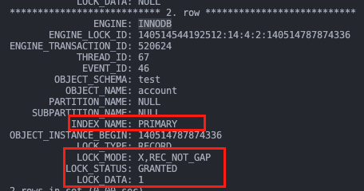

A 在 T4 时刻因为等待 id=3 的行锁而阻塞。
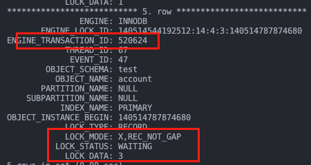

至此，死锁的原因就找到了：

- A 占据 id=1 的锁，等待 id=3 的锁
- B 占据 id=3 的锁，等待 id=1 的锁

可以看到，A 是按 id 从小到大的顺序来获取锁的，而 B 是按反顺序来获取锁的，自然会出现循环互锁的情况。
那么如果 A、B 都按相同顺序获取锁呢？后来事务会因所需的锁被先前事务占据而被阻塞，也就破坏了循环等待条件。

基于此，只需把 B 的两条 sql 换下顺序就可以了，转账逻辑就变成了 id 越小的 sql 就越先执行。
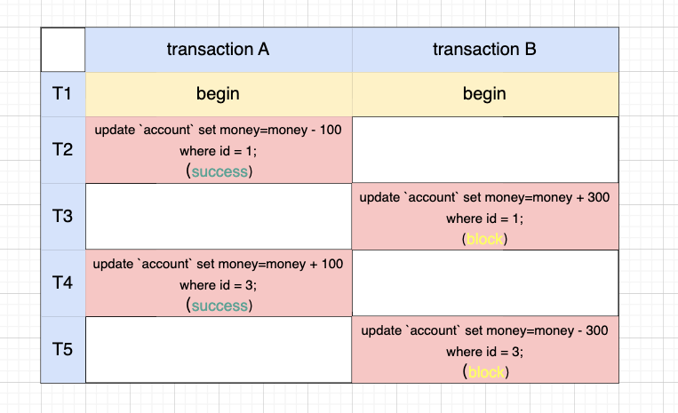

## 账户表插入新用户
<!-- ```sql
original
select * from `account` where id = 2 for update;
insert into `account`(id, money) values (2, 2000);

hotfix
insert ignore into `account`(id, money) values (2, 2000);
``` -->

还是例子 2 中的账户表，现有并发事务 A、B，同时判断表中是否存在 id 为 2 的用户，如果不存在则写入，执行 sql 如下，发生了死锁：
（注意：for update 表示查询是当前读，会加锁；普通查询是快照读，不加锁）
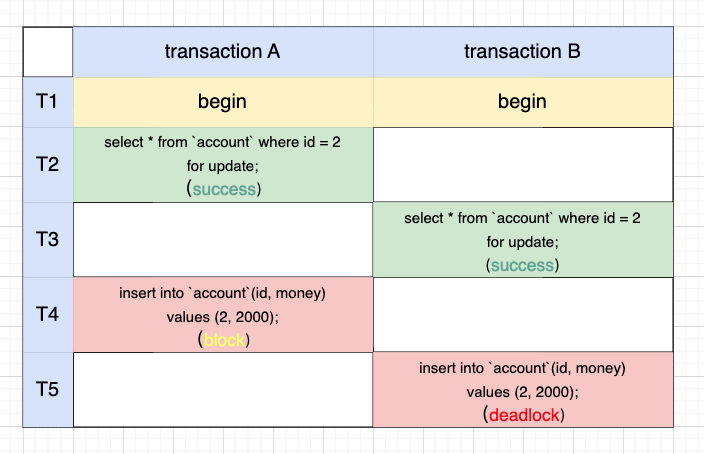

查看 data_locks 表，事务 B 在 T3 时刻执行完后，事务 A 在主键 id 的 (1, 3) 上加了间隙锁，事务 B 也在 (1, 3) 上加了间隙锁，因为间隙锁之间互不冲突。
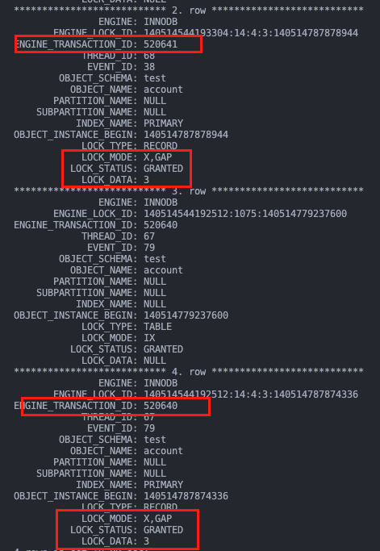

事务 A 在 T4 时刻插入时被事务 B 的 (1, 3) 间隙锁所阻塞。
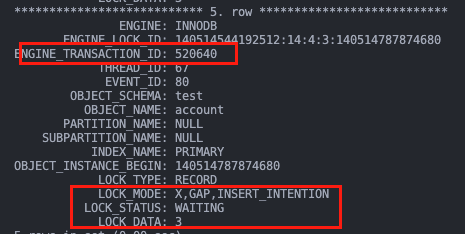

至此，死锁发生的原因找到了：
- A 插入时被 B 的间隙锁阻塞
- B 插入时被 A 的间隙锁阻塞

如果 select 语句去掉 for update，也就是普通查询，则执行逻辑会有所不同：
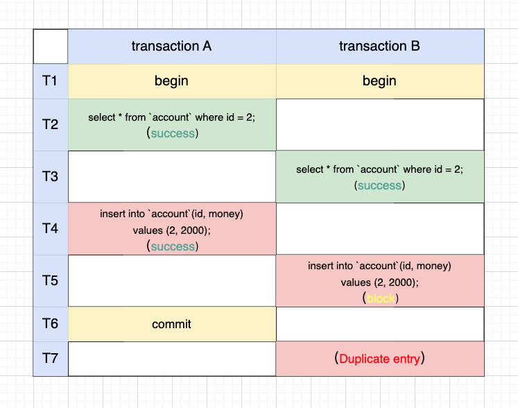

原因在于普通查询不会加间隙锁，事务 B T5 时刻被事务 A 在 T4 时刻占据的 id=2 的行锁所阻塞，直到事务 A 提交释放锁，事务 B 才能往下执行，并报错唯一键冲突。
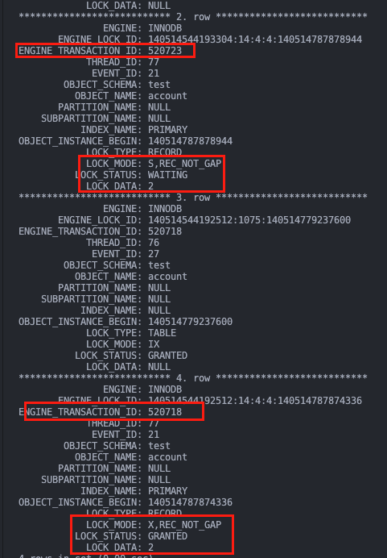

上述的演示都是在可重复读级别下的，如果是读已提交级别，是不存在间隙锁的，不管是当前读还是快照读的演示，都是报唯一键冲突而不是死锁。

如果即不想死锁也不想报唯一键冲突，可以采用 insert ignore 语句，该语句在不冲突时写入、冲突时直接忽略本次更改。
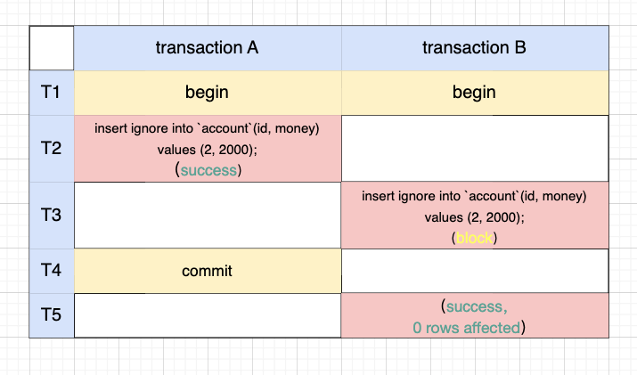

总结上面三个死锁例子，在规避死锁时可以采用这些思路：
- 减少事务期间依赖的锁，可降低死锁概率，如果只需申请一个锁，则破坏了请求和保持条件，从而避免了死锁
- 在事务一开始就申请所有所需的锁，破坏请求和保持条件（注意这种方式比较适合短事务，如果用于长事务，可能会让后续依赖相同的锁的短事务一直阻塞，导致饥饿超时）
- 按同样的顺序去申请锁，破坏循环等待条件
